# 引言

## 信号的定义

​		给信号下个非正式的定义，就是<u>一或多个自变量的函数</u>，<u>这些变量通常携带了某种信息</u>。
我们所指的系统，通常用来处理信号。

​		信号的一个常见例子可能是，语音信号。你可以将气压认为是时间的函数，或者是电信号
穿过麦克风之后作为时间的函数。像是我这里所显示的：

​                              		

​		本案例中 它是时间的函数。作为自变量的时间是连续的，像这样的信号，我们通常将其称作连续时间信号。在这个例子中，信号是一个自变量的函数，我们将其称为一维信号。其中，只有一个自变量，而不是几个自变量。

​		所以语音信号就是，一维的连续时间信号的例子。信号当然还可能是多维的，其自变量不一定会是独立变量，或者时间变量。一个常见的例子，就是图像。

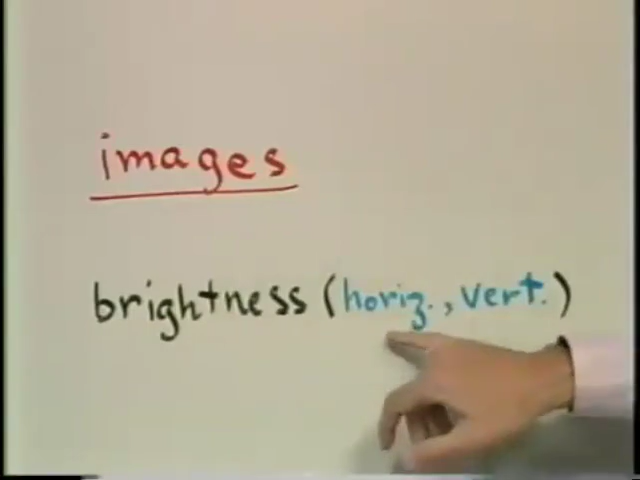

​		作为信号的图像，我们可以认为它表现了，在水平和垂直方面上不同的亮度，所以亮度就成为了这两个空间变量的函数。于是它就是一个二维信号，而其自变量通常是连续的，但是当然 自变量并不是时间变量。

​		这里值得一提的是，通常为了方便，我们在谈论信号的时候，常将自变量叫作时间变量，不管其是否表示时间。

​		让我用一幅图像来举个例子，这个人是J. B. J. 傅里叶。

​										

我们在这门课中会学到许多概念，而其中很多概念的完善，都要归功于傅里叶。在看这张照片时，我们不仅要看到其中的傅里叶，还要意识到这张照片本身还是一种信号，而亮度就是其中水平和垂直空间变量的函数。

​		图像作为信号的另一个例子，我们来看一幅航拍照片，这是一张自数条路上方俯瞰的航拍照片，道路从照片上大概能够辨别。这个信号的一个问题在于：道路系统被云层遮蔽了。

​										

​		我想接着示范举例，系统如何处理这样一个信号，也即至少试图去多少弥补照片中云层所造成的影响。

​		尽管在本课堂中将进行的具体分析中，我们将注意力主要放在一维信号上，事实上 我们也常用到二维信号，和更具体的图像，来阐述一些概念。

​		语言和图像都属于，被我们称作连续时间信号的案例，因为它们都属于连续变量的函数。同样重要的一种信号，我们在本课程中将进行关注的是离散时间信号。

​		所谓离散时间 我们指的是作为整数变量的函数的信号，所以 具体来说 它只取参数中的整数值。这是一个离散时间信号的图示：

​										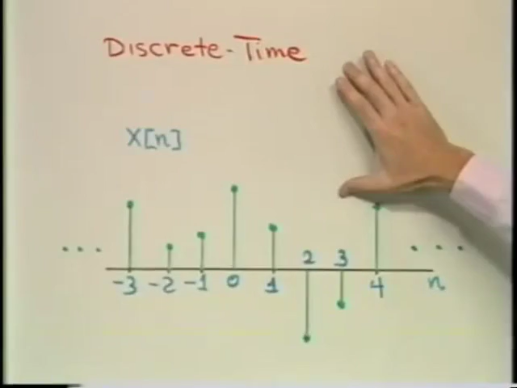

​		离散时间信号有很多种形式，一个很常见的例子就是，经济活动时间序列中使用的离散时间信号。比如说股市分析：

​										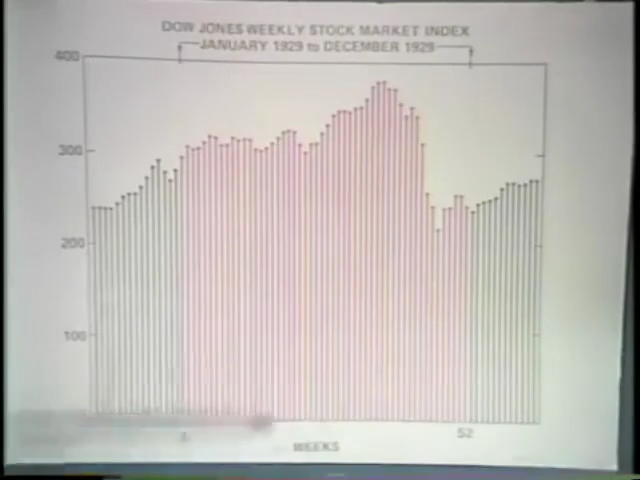

我现在展示的是一维离散时间信号的例子。
		正如连续时间信号中，除了有一维信号 还有多维信号。同样的，离散时间信号中也有多维信号。

​										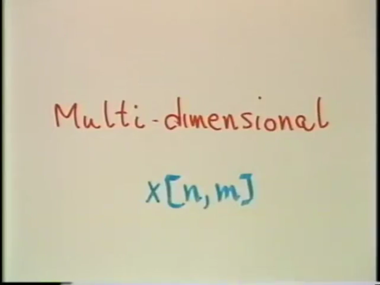

我们谈过的离散信号就是一些序列，就是两个整数变量的函数。举个例子，这表示了一个空间-时间的阵列，n是在水平方向上的阵列数，m是在垂直方向上的阵列数。

​		连续时间信号和离散时间信号都非常重要，离散时间信号的重要性正在持续增加，这大部分是因为
目前已有及新生的科技，允许对连续时间信号进行如下处理：先将其转换成离散时间信号，再以离散时间系统对其进行处理。

## 系统的定义

​		正如我所说，<u>系统对信号进行基本处理，其当然包括输入和输出</u>。根据我们所要谈论的是连续时间或是离散时间，系统可能是连续时间系统或者离散时间系统。如果是连续时间的话，我在这里标出了输入x(t)和输出y(t)。如果我们讨论的是离散时间系统，我将以一个离散时间变量来表示输入，当然了 也以一个离散时间变量来表示输出。

​										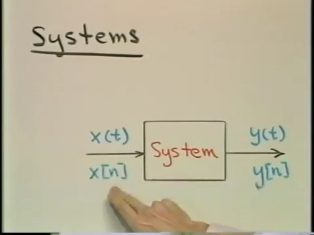

​		总体来说 系统是很难掌握的，因为其定义非常宽泛。在认识并分析系统时，我们将试图发掘一些具体的，有用的系统特性。
​		讨论线性时，基本上可以将系统分为线性的系统或非线性的系统。
​		讨论时变时，也可以将系统分为时不变系统和时变系统。
​		这种划分可能涵盖了所有系统。本课程主要关注的是线性时不变系统（LTI）。

​		正如刚才简短的介绍中，所提到的系统的功能，让我先就一维连续时间框架举例说明，之后再举一个离散时间的例子。用合适的系统来处理信号的例子。

 		我想举的例子，是关于修复旧录音的。年代久远的录音，是用一支机械喇叭来进行录音的，喇叭的声学特征每天都不一样，而由于喇叭的声学特征，录音听起来就很模糊。Stockham教授发明了一种系统，来处理这些老录音。使得一些录音系统本身的声学特质和造成的扭曲被去除掉。我想将其作为合适的连续时间系统来处理信号的例子。

​		这是一个实例，用相应的连续时间系统来处理连续时间信号。

​		现在我想再举一个例子来阐述对离散时间信号进行的一些处理。我想举的例子，是我之前展示过的一个离散时间信号-股市指数。

​										 

横坐标是周数，纵坐标是每周指数。在这里 尽管它仍是离散时间信号，为了易于展示的目的，我们将各个点连起来，将各个点连成一条连续的曲线，所以图片上就不会满是垂直的线了。这是一个离散时间序列表示了十年间每周的道琼斯指数。

​		事实上对于这样的经济时间序列，常见的做法是使其变的平滑，将它平均分布到某段时间范围内，以突出其中缓慢的变化，并减弱其中迅猛的变化，而这就是针对离散时间系统的处理。

​		当你听到别人说，比如股市分析中的51日移动平均曲线，那实际就是以特定的离散时间系统来处理股市指数。就本案例来说 处理的结果是生成了一条平滑的曲线。
​										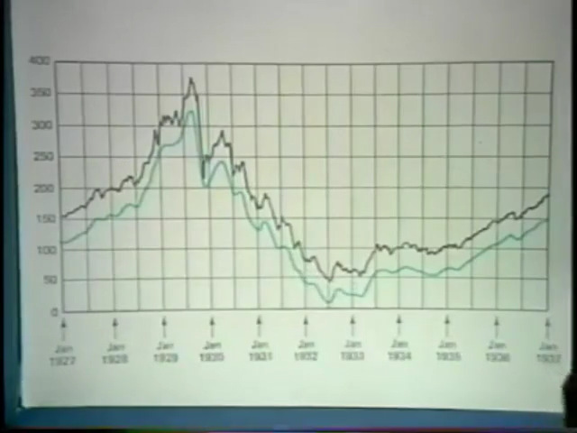
这里你看到的是原始的每周指数，这是对此序列进行处理后的结果。<u>使用合适的系统来使曲线平滑</u>，实际上这就成了一条移动平均曲线。所以在这里 在这条平滑的曲线中，仍可观察到整体的下跌趋势。

​		第三个例子，就是对图像进行处理的结果，具体来说就是我们之前谈过的图像，有云层遮盖地区的，有问题的航拍照片。用某种系统对其进行了处理，该系统其实既是非线性又是时变的。这种处理的结果为：

​										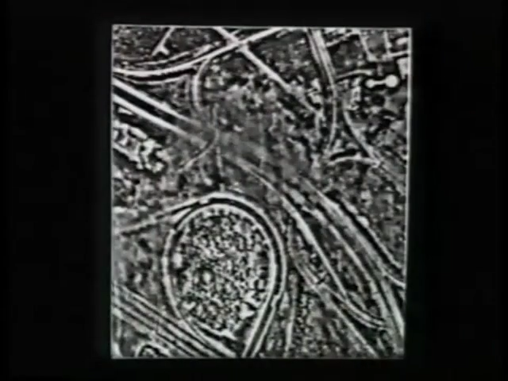

我们看到的是对云层效果的合理补偿。

我还要说 在这个案例中，尽管原始信号是连续时间信号，也就是说自变量，在空间航拍照片中是连续，事实上在处理过程中，照片首先经过一种叫作采样的处理，被转换成一个序列。我们后面将会谈到这种处理实际是通过数码计算机来进行的。

​		好的 这是一些使用特定系统来处理连续及离散时间信号的案例，其中包括了一维信号与多维信号。<u>在谈到系统时，我们将其看作是一个大模块，有着合适或相关的输入及输出</u>。

​		而随着我们进入本课程第一部分，系统常因为不同的原因而相互连接起来。我们将谈到的一些相互连接将系统连接成所谓的，串联连接（级联连接）、并联连接、反馈连接。

​		反馈连接实际上非常重要又非常有用，将成为本课程结尾阶段的主要话题。反馈在很多情况下都有重要作用：如果有一个不稳定的系统，反馈常被用来稳定这个系统。

我们在本课中谈论信号和系统时，有几个域，特别是其中两个，我们将发现对信号和系统的分析和表达来说是非常方便的。一个是<u>时域</u>，这是我们在本课程中目前所考虑的也是一直所关注的。但同样重要的是被称作<u>频域</u>的内容，它是信号的一种表现，也是对系统进行分析的方法。在频域表现的框架中，我们将探索的一些主题，包括傅里叶转换、拉普拉斯转换，以及拉普拉斯转换所对应的离散时间转换，也就是Z转换。

​		刚开始接触时域和频域，你可以想象 比如一个音符被播放，时域表示代表了声压作为时间的函数是如何改变的，而频域表示则代表了该音符的频率信息表示。我想用铁片琴演奏一个音符，并同时展示两种域，左边的屏幕代表时域，显示的是信号的表示，右边的屏幕则代表频域。

​												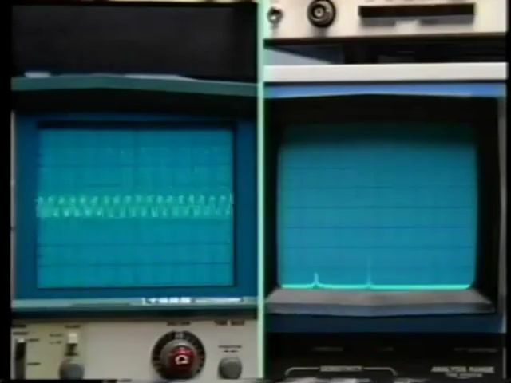

在左边的是时域波形，在右边我们看到的是频率信息，表示音符中包含了数条谐波曲线。

​		我在这节课里想讲的最后一点，我想在一开始就强调一下，视频仅是本课程的一个组成部分，课本和视频课程的指南是同样重要的。具体来说 重要的不止是看视频，但是也要同时或伴随着视频，认真读课本上的内容，也要认真研究视频课程指南上的问题。当然像这样，你的投入跟所得是成正比的，如果你付出了合理的时间和努力，希望你会觉得本课程有益又有趣，我真心希望会是这样，谢谢！

# 正弦信号与指数信号

​		上节课中，我介绍并解释了我们在这门课中，将接触到的信号与系统。今天这堂课 我想讲得更具体些，特别是介绍一些基础信号，包括连续时间信号和离散时间信号。随着课程的进展，这两者将成为本门课的重要基石。

## 正弦信号

​		首先我们来谈谈连续时间正弦信号，也许大家对此已经很熟悉了连续时间正弦信号的数学表达式。<u>其中有三个参数A、ω₀、Φ，参数A指的是振幅，参数ω₀指的是频率，参数Φ是相位</u>。

​												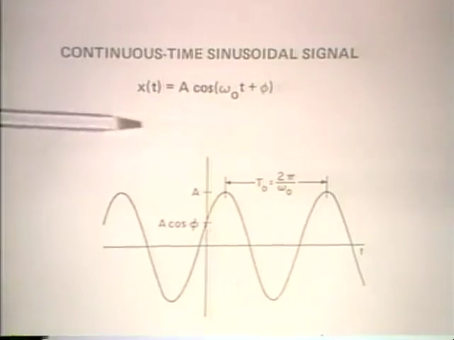

​		正弦信号有很多重要的属性，随着课程的进展，我们会发现这些属性用起来很方便，其中之一就是正弦信号具有周期性。我说的周期性指的是，若发生适当的时移 这里我用T₀表示，信号会自我复制。

​				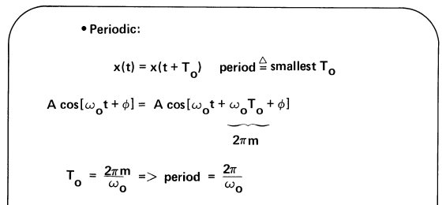

​		

​		此外 正弦信号的一个实用属性就是，正弦的时移等于相变。

​                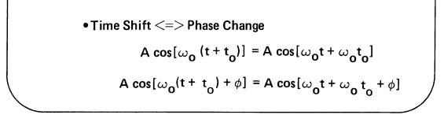

如果我们把ω₀t₀看作是相变，无论相变量是多少，我们都能求出该等式的时移。或者反过来 无论时移的值是多少，我们都能求出适当的相变。<u>所以时移等于相变，相变也等于时移</u>。

​		通过观察这张图，我们会发现另一个非常重要的属性，即它是偶函数。我们发现这个属性，用在信号上很有帮助。偶信号指的是 如果我们把它绕时间原点翻转，得到的图像和原来的图像一样。在数学表达上，如果我们把时间宗量换成其相反数，函数值保持不变。

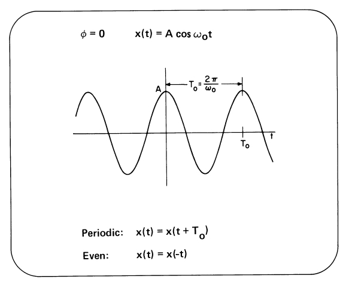

​		如果我们选的相变不是0，而是–π/2用于余弦信号中，会得出具有适当相位的正弦，代入相变发生的所有变化，就等于代入时移发生的变化。频率和振幅保持不变，它仍然具有周期性，周期还是2π/ω₀。

​		我们把正弦和余弦对照来看，即含有这个相位的正弦，它的对称性和之前不同，称为奇对称。用图像来解释奇对称的定义就是，如果我们<u>把信号绕时间原点翻转，并把函数值乘以-1</u>，这就是反对称性。这不是镜子成像，而是镜子成像再倒过来。用数学公式表示的话，奇函数符合这样的代数表达，即如果用-t来替换x(t)中的t，得到的函数值是-x(-t)。因此如果用某一宗量的相反数来替换它，得到的是原函数值的相反数。

​		很多情况下 并不是直接说正弦信号，而是分为偶信号和奇信号。

​		现在我想转换到离散时间正弦的讲解上。我们将会发现，离散时间和连续时间的正弦信号很像，但是也有很多非常重要的<u>差异</u>，我们不仅要关注二者的相似点，也要重点分析它们的区别。

​		首先我们来看看它的数学表达式，离散时间正弦信号如果要用数学方法来表示，就是Acos(Ω₀n+Φ)，和连续时间信号一样，参数A指的是振幅，Ω₀是频率 Φ是相位。这里的自变量是一个整数变量，所以数列中的宗量只会取整数。

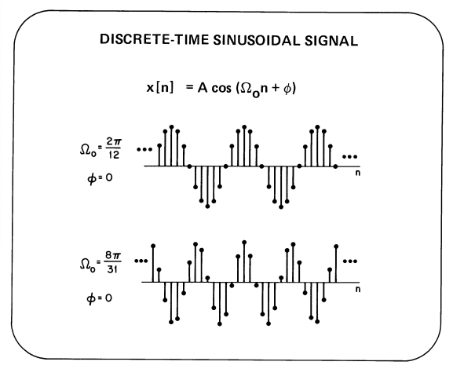

​		我们先来讨论时移和相变的关系。我们知道，在连续时间信号中，时移等于相变，反之亦然。那在离散时间信号中，时移和相变有什么关系呢？

​		如果我做一个时间移位，则会产生相变。我们不难发现只要插入一个时移(n+n₀)，如果我们把这个宗量展开就得到(Ω₀n+Ω₀n₀)，这里的Ω₀n₀等于△Φ(相变)，因此显然时移产生了相变。

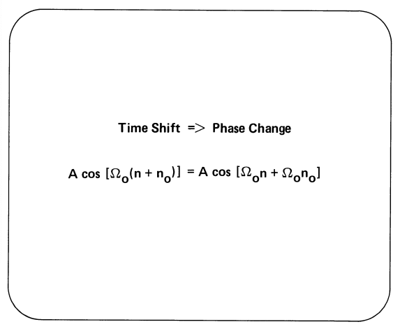

​		

​				如果把下图所示的余弦信号移动1/4个周期，时移等于π/2的相位位移，得到的是相位是–π/2的余弦，即正弦。

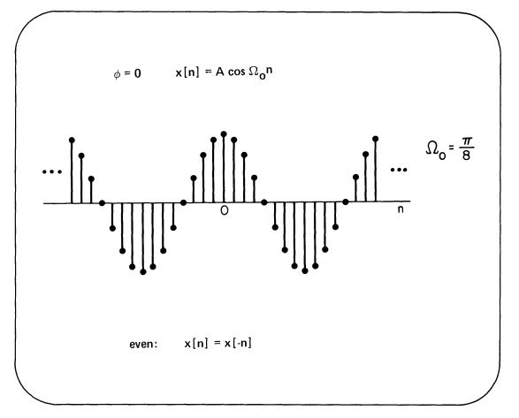

​		余弦信号具有偶对称性，数学表达就是x(n)=x(-n)。

​		正弦信号具有奇对称性，数学表达就是x(n)=-x(-n)。

​		

​		我们得出一个结论，那就是时移等于相变，那么反过来说是否也成立呢？在连续时间信号中，正反两种说法都正确，那在离散时间序列中也是如此吗？

​		

​		答案是否定的，在离散时间序列中，相变不能简单解释为序列的时移。

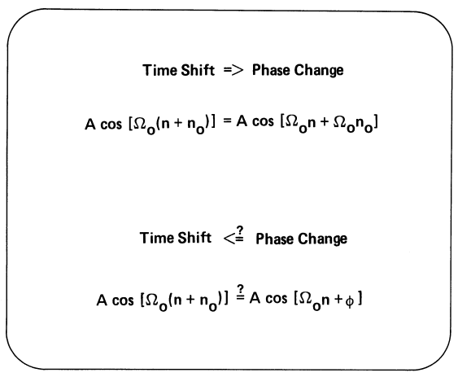

我们观察等式左右两边，把这个展开得到(Ω₀n+Ω₀n₀)，必定等于(Ω₀n+Φ)，所以Ω₀n₀必定等于相变，大家可以明显发现，n₀的值取决于Φ和Ω₀的关系，不一定是个整数。在连续时间信号中时移的数值可以不必是个整数，在离散时间信号中，当我们说到时移，因为离散时间信号的本质，时移显然必须是个整数。所以相变和时移，必须满足这一特殊关系，即当<u>n₀是整数时， Ω₀n₀等于相变</u>。

​		以上是连续时间和离散时间信号之间的一个区别。

​		现在我们来看另一个区别，即周期的问题，我们又将发现在连续时间情况下，所有的连续时间正弦信号都具有周期性，而在离散时间情况下并不一定如此。

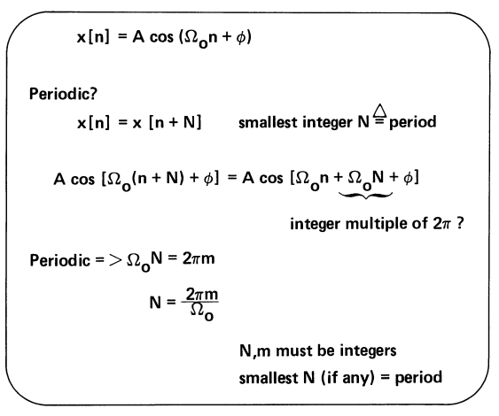

我们看一个一般的正弦信号，振幅 频率和相位取任意值，为了使其具有周期性，我们需要一个值N，如果我们将序列移位N，还会得到相同的序列，那么我们将N的最小值定义为周期。现在我们把它代入到余弦表达式中，展开后，如果移位N后得到相同的序列，那么Ω₀N必须是2π的整数倍，它就具有周期性。只要把这个除一下，就得到周期N=2πm/Ω₀。但是事实上 得出的N或2πm/Ω₀的值 也许不是整数。

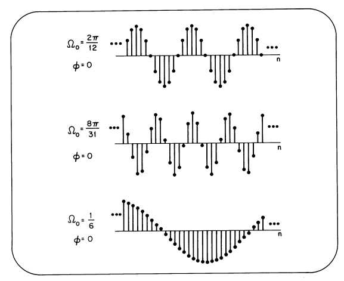

​		举个例子 我们来看这些特定的正弦信号。

​		第一个正弦，它的频率Ω₀=2π/12，2π/Ω₀=12，12是个整数，意味着这个正弦信号具有周期性，周期就是12。

​		第二个正弦，它的频率Ω₀=8π/31，2π/Ω₀=31/4，31/4不是整数，如果把2π/Ω₀找一个整数相乘以得到另一个整数。我们把它乘以4，于是2π/Ω₀*4得到31，即周期是31。

​		第三个正弦，它的频率Ω₀=1/6，如果你光凭肉眼看 会觉得它具有周期性，2π/Ω₀=12π，我能用哪个整数乘以12π得到另一个整数呢？显然这个整数并不存在，因为π是个无理数。也就是说这个正弦信号并不具有周期性，虽然看起来具有周期性。

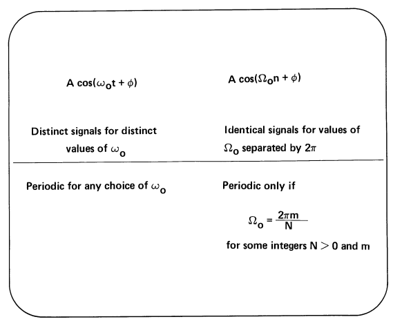

​		我们已经了解了，连续时间信号和离散时间信号的一些重要区别。首先在连续时间信号中时移和相变始终相等；而在离散时间信号中，时移等于相变，而相变不一定等于时移。连续时间信号始终具有周期性，而离散时间信号不一定。对于连续时间信号，无论ω₀的值是多少 该信号都具有周期性。而对于离散时间信号它要具有周期性只有当2π/Ω₀乘以一个整数，能得到另一个整数时具有周期性。

​		连续时间和离散时间信号二者之间，还有一个重要的区别。对于离散时间信号，频率 Ω₀是区间 2π之内的值，信号各不相同。当Ω₀变化超过区间(π,-π)或(0,2π)，我们将看到同样的序列重复出现，虽然乍看之下数学表达式不一样。所以对于离散时间信号，若Ω₀减去2π整数倍后信号仍相等。而在连续时间信号中 这点不成立，若变换ω₀的值，会得到不同的正弦信号，即这些值不相等。

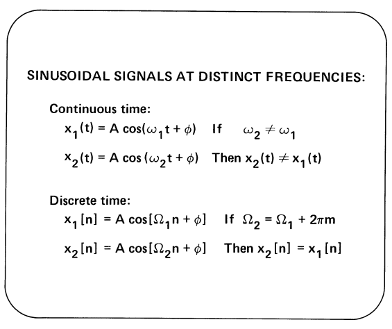

​		我要强调一点，正弦信号将为我们的学习起到非常重要的作用，它是一般信号，是系统描述的基石，而且引导得出傅里叶分析的整体概念，我们在本门课程中将充分利用这个概念。

## 指数信号

​		我现在想转换到另一类基石的讲解上。在一定条件下 它与正弦信号关系密切，即实指数和复指数信号。

​		先讨论实指数

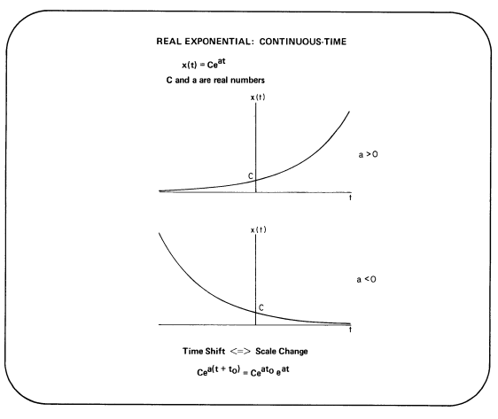

​		对于连续时间的实指数信号，它数学表达式为x(t)=Ce^αt^，在实指数信号中C和α都是实数，即它是一个指数函数。如果α>0，这个指数函数的值递增；如果α<0，这个指数函数的值递减。对于该指数函数，<u>时移等于标度变化</u>，这和正弦信号的情况不同，对于正弦信号，我们知道时移等于相变，但是实指数信号若发生的时移，等于标度的变化。

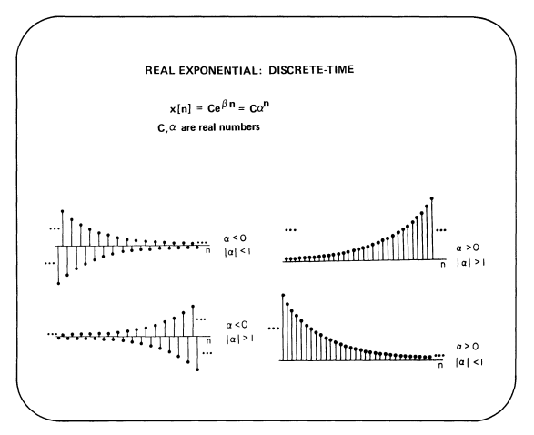

​		在离散时间的条件下，我们有几种不同的表达方式，Ceᵝⁿ或者用更简便的方法Cαⁿ（α=eᵝ）。但通常情况下，对于离散时间，我们用Cαⁿ来表示指数函数。以α为底，当指数n增加的时候，函数值就以指数级变化。

- $α>0$

​		$|α|>1$，序列呈指数级递增。

​		$|α|<1$，序列呈指数级递增。

- $α<0$

  $|α|>1$，序列呈指数级递增

  $|α|<1$，序列呈指数级递增

  序列值呈正负交替，n为偶数时为正值，n为奇数是为负值

​		回头看这个表达式$Cαⁿ$，如果α是正数，α和β的关系就是$β=lnα$，如果α是负数，若用Ceᵝⁿ来表达函数，那么可以得出β是一个虚数，这个原因可以解释(并非唯一的原因)，为什么在离散时间条件下用αⁿ来表示实指数函数比eᵝⁿ更方便。

​		接着讨论复指数信号。

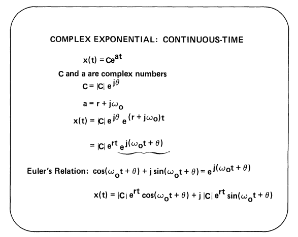

​		对于连续时间的复指数信号，它数学表达式为x(t)=Ce^at^，参数C和a为复数，我们把C写成极坐标形式，于是这里有一个绝对值和一个角位；我们把a写成直角坐标形式，所以它包含一个实数部分和一个虚数部分，然后我们把这个项代入原表达式中，合并一些项，把含虚数部分合并起来，在利用欧拉公式，就得到了底下的这个表达式。

​		它包含了实数和虚数的正弦分量，相位差为90°，而且振幅|C|e^rt^随时间变化，这部分是实指数。该信号的正弦分量中，实数和虚数部分的相位差是90°。

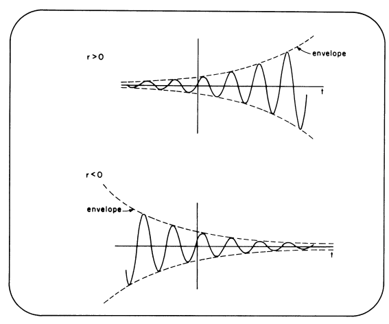

​		$r=0$时，得到的是一个纯复指数函数，包含实数和虚数两部分正弦信号。这些指数始终具有周期性，因为实数和虚数的正弦分量都具有周期性。

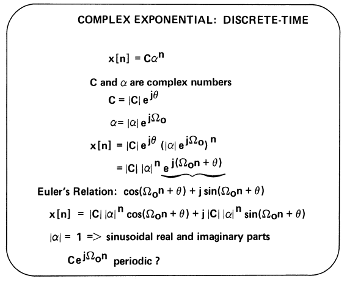

​		在离散时间条件下，情况基本相同。离散时间复指数信号表达式和实指数的表达式很像，C和α都是复数。

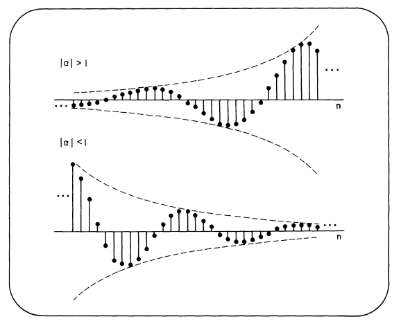

​		当α=1时，是否具有周期性要取决于Ω₀的值。

		现在我们来总结一下这堂课，我为大家介绍并讨论了几个重要的基础信号，特别是正弦信号 实指数和复指数信号，讨论得出的重要结论在课本中有重点强调，那就是它们之间有一些重要的相似性，但是也有一些重要的区别。我们把正弦信号和复指数信号作为研究一般连续时间和离散时间信号的基石，这些区别就会慢慢出现。
		下节课，我将讨论其他重要基石，即阶跃信号和输入信号。这些内容与我们今天所讲的正弦信号和指数信号合起来，将会成为信号与系统分析的基石。

# 信号和系统

## 信号

​		上节课中，我们分别在连续时间和离散时间情况下，讨论了正弦、实数以及复指数信号，这些信号将成为接下来的课时中，我们讲到傅立叶分析时会用到的重要基础。

​		在今天的课上，我想讲一些其他的基本信号，主要包括单位阶跃和单位脉冲信号。

​		让我们从离散时间的单位阶跃和单位脉冲开始。

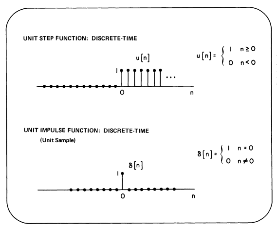

离散时间单位阶跃是一个序列，具体点讲 本序列 参数(n)为负值时 等于0，参数为正值或0时 等于1。所以 从数学上讲 当n大于或等于0时，单位阶跃序列=1；当n小于0时 序列=0。

单位脉冲序列，同样是以一种简单的方法定义的。单位脉冲序列无论参数为何值序列都等于0 除非n=0。

​		因此 单位阶跃和单位脉冲序列，都可以从数学角度进行简单定义。而事实上 它们之间也可以通过简单的数学关系 彼此相关。具体来说 单位脉冲可与单位阶跃通过这种关系式相联。

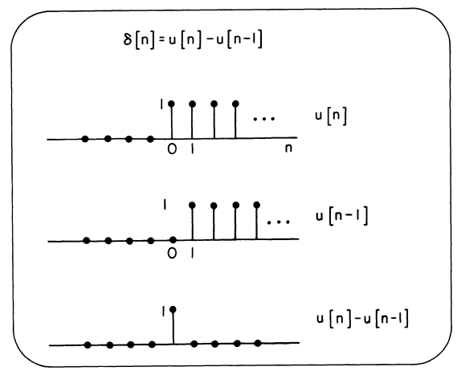

 															$δ[n]=u[n]-u[n-1]$

因此 从数学的角度讲 这种关系式被称为一阶差分。也就是说 u(n)和u(n-1)之间的差值，正好是单位脉冲，偶尔这也被称作单位样值。

​		

​		现在 以同样的方式，我们可以用单位脉冲来表示单位阶跃。

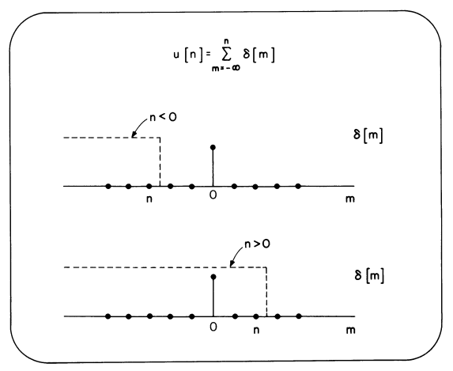

如果我们想求某个单位脉冲的值从负无穷到n的总和，那么这个动求和，事实上就等于单位脉冲。

我们通过简单观察很清楚地可以看到这个公式，当n小于0时，总和中没有累积起任何值，当n大于0时，总和中会累积一个非零值，也就是 n=0时的单位样值。

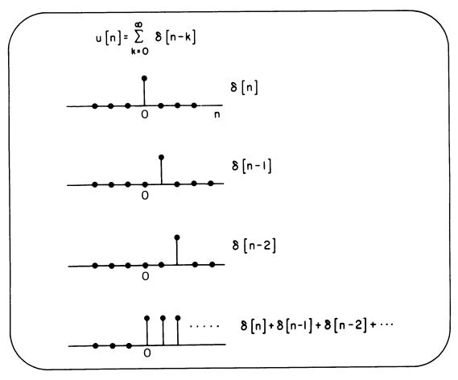

回过头去看，实际上我们可以将单位阶跃序列看作是一串单位脉冲，一个接一个的单位脉冲。因此 如果我们考虑求<u>延时脉冲的总和</u>，我们把这些陆续加起来，那么我们所累加得到的就是一个单位阶跃序列。

看最下面的那个表达式，从数学上来讲，这对应的是 n=0时的一个脉冲，加上n=1时的一个脉冲，加上n=2时的一个脉冲 以此类推。

​		现在 连续时间情况下，我们有非常多类似的情况。

​		首先 让我们从连续时间单位阶跃说起。

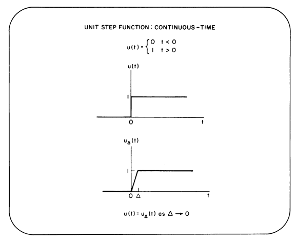

连续时间单位阶跃函数，是一个时间函数u(t)，当t小于0时 它为0；当t大于0时 该函数为1。现在一个明显的问题是：当t等于0时会怎样？难点就在这里，离散时间的情况下 t=0并不成其为一个难题。但连续时间下单位阶跃函数实际上是不连续的，这就产生了各种不同的数学问题。

所以实际上，我们需要 将<u>单位阶跃函数看作是某个连续函数的极限</u>。于是 我们可以定义一个函数，我在这里将其指定为U~Δ~(t) 。那么U~Δ~(t) 是一个时间函数，当t小于0时 它为0，线性增加至tΔ，tΔ对应的是这个断点(1)。

所以 我们可以把该非连续单位阶跃看作，当Δ趋向0时，U~Δ~(t) 的极限形式。

​		连续时间的情况下，我们也希望找到一个单位脉冲函数。在离散时间的情况下 能有一个相当简单的定义，但在连续时间的情况下 则稍微有点儿困难了。为了更好地下定义，让我回到离散时间下的定义，或者更确切地说 回到离散时间的情况下，单位阶跃函数和单位脉冲函数两者的关系式。

​		离散时间中，单位脉冲函数是单位阶跃函数的一阶差分。同样地 连续时间里，我们可以讲<u>单位脉冲函数是单位阶跃函数的一阶导数</u>。当然 我们刚刚讨论完一个事实，即单位阶跃函数实际上在t=0时是非连续的。我们可以将连续时间的单位脉冲函数看作单位阶跃近似值U~Δ~(t) 的导数（限制条件是Δ→0）

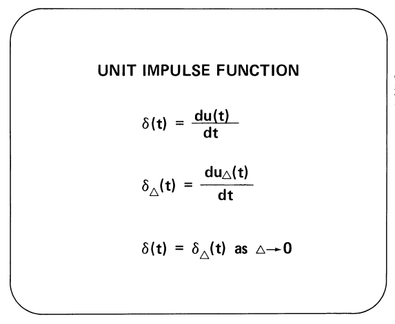

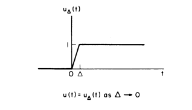

​		如果要求U~Δ~(t) 的导数，但t<0时，导数为0；0<t<Δ时，导数为某个常数，t>Δ时，导数为0。

​		所以U~Δ~(t)的导数𝞭~Δ~(t)，在0~Δ范围内的值为$\frac{1}{Δ}$，它是一个矩形，高度是1/Δ，宽度等于Δ。注意无论Δ的值是多少，面积始终等于1。现在 我们让Δ趋向于0，矩形的宽度变短了，矩形的高度也变大了，面积仍然为1。Δ趋向于0的时候，当然 宽度也趋向于0，而高度则趋于无穷。图形上 我们可以用一个箭头来描绘它，箭头所反映的是，当t=0时 出现了一个脉冲，脉冲的高度用于反映脉冲的面积。这种情况下，因为我们取了单位阶跃导数，所以高度等于1。因此 脉冲的宽度为零 高度无穷 面积为1。

​		连续时间里，如果脉冲是阶跃的导数，我们可以有理由认为阶跃是脉冲的积分。

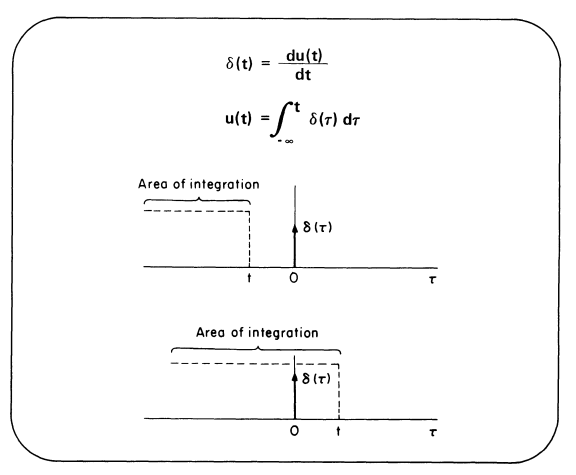

事实上 的确也是这样的。从数学上讲 连续时间下的单位阶跃函数是单位脉冲函数的动积分。积分从负无穷大到时间t，其中t为参数 ，t小于0，积分中就无法累计面积，如果我们看到t大于0，那么 我们就在脉冲下累计面积。

## 系统

​		好了 现在进一步讨论脉冲和阶跃功能的使用，我们将看到他们提供了一个非常方便而强大的机制，用于描述某一类系统——线性时变系统，这将是下一讲的主要重点。这堂课剩下的时间我们将总体上谈一谈系统，然后讲一些系统的属性。

### 什么是系统

​		总体上 一个系统最普遍的定义就是<u>从输入信号到输出信号的一种转换</u>。因此 在连续时间情况下我们有一个连续时间系统，输入 x(t)，输出 y(t)。一般我们会用方框来表示发生从x(t)到y(t)的转换。有时我们也用速记符号（→）来表明输入x(t)转换成了输出y(t)。

​		离散时间情况下，定义是完全一样的。当然 输入是序列，输出也是序列。而且速记符号也是类似的。

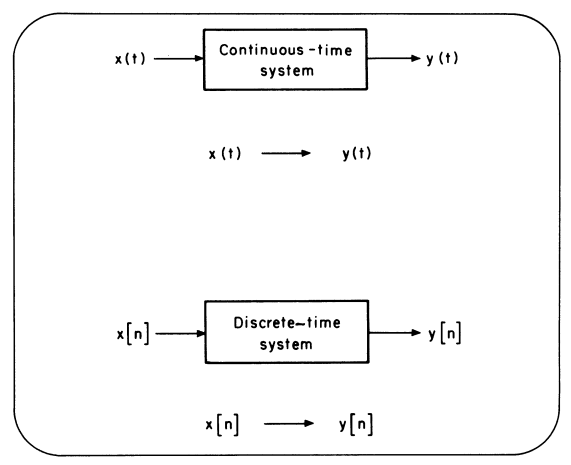

### 系统级联

​		通常 讲到系统时，一般会讲到系统的互联。在术语介绍方面，让我介绍一些，基本的重要的系统互联术语。首先是<u>系统级联</u>，有时也叫做系统互联的串联。

把两个系统级联，这意味着取某个系统的输出将其作为另一个系统的输入。当然也可以将这两个系统以相反的顺序级联，即 取系统二的输出，把它输入到系统一中。

​		重要的是要牢记在一般情况下，对于一般的系统，系统级联中 顺序是非常重要的，根据哪个系统第一 哪个系统第二，整个系统的转换将有所区别。很神奇的是，等我们讨论到<u>线性和时不变</u>问题时，就该特定的系统类别而言，<u>整体的系统转换是跟系统级联的顺序无关的</u>。

​		让我们来看看在另一个互联的例子，这是一个并行的系统互联，输入同时进入系统一和系统二，然后这两个系统的输出相加成为整体系统的输出。现在 这个特殊的情况下，与级联相比，无论系统是怎样，平行排列的顺序跟整体的转换是没有关系的，即我们只是将输出加起来，输出加起来的顺序是任意的。

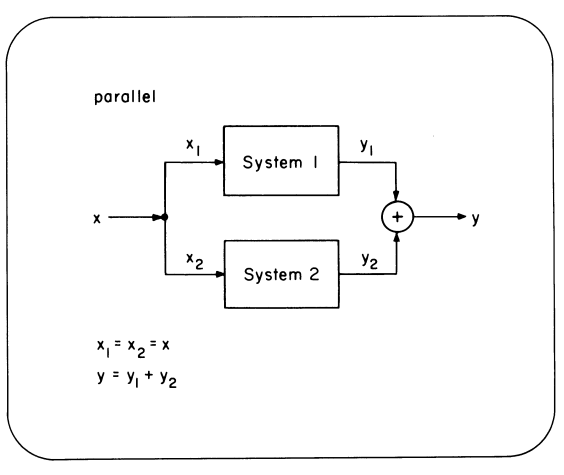

​		让我们看看另一种互联，这个称作反馈互联，并且 这种互联将成为非常后面的课程中一个非常重要的主题。反馈互联意味着我们有一个系统一，既有输入又输出，系统一的输出就是整个系统的输出。该输出接下来反馈到系统二中，而系统二的输出，又加入到整个系统的输入中去。即一个系统一的输出，被反馈到系统二中去，再进入整个系统的输入，然后该总和 就是系统一的输入。

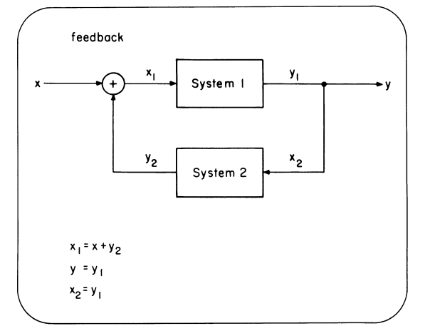

​		随着课程继续，我们会看到系统会同时具有串联 并联和反馈互联等等互联方式，以实现各种各样的应用。

### 无记忆性

​		现在把我们的注意力转到系统属性上，我们将对其中一些进行定义，其中一些 我们希望系统是具有的，而一部分 我们也许是不希望系统具有的。

​		首先是无记忆属性，无记忆的系统是指在任何给定的时间点上的输出t~0~，只跟同一时间点上的输入有关。无记忆系统中，某个特定时间点上的输出只跟该时间点上的输入有关。这一定义适用于持续时间，也适用于离散时间。

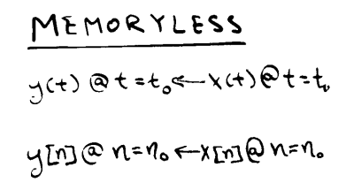

​		让我们来看看第一个例子，连续或离散的时间中，其输出是输入的平方，称其为平方电路。任何时间点上，一个信号的平方只跟这个时间点上的信号值有关，平方电路显然是一个无记忆系统。

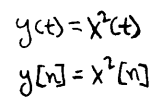

​		另一种重要的系统，被称作积分电路，输出等于输入的积分，这并不仅仅是x(t)的积分而是x^2^(t)的积分，无论我们在积分之后或之前平方，重要的一点是，因为我们对输入做了积分，则任何时候的输出值就是一个过去积分的积累，在本质上意味着记忆。为了求得在一个给定时间上的输出，需要知道该时间点之前很长一段时间内的输入，因此 这种系统其实是是有记忆的。

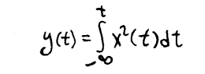

​		第三种系统是离散时间系统，输出等于 但不完全等于输入，某个时间点上的输出等于延迟 或移位了一个样值的输出，因此该系统被称为单位延迟系统。现在的问题是该系统是无记忆的吗？它的输出只取决于输入，任何时间点上的输出，只跟某个时间点上的输入有关。但是 正因为它取决于我们看到的，时间之前的某个时间点上的输入，它违反了我们所讲的无记忆的定义，所以实际上单位延迟是一个有记忆的系统。

​		本质上来讲 有延迟就有记忆，所以这就是记忆和无记忆系统。

### 可逆性

​		现在让我们转到另一个属性，这个属性系统可有可无，称为<u>可逆</u>属性。可逆的意思是如果已知系统输出，就可以计算出唯一的输入，这就是可逆的一种定义。换句话说，可逆意味着 已知输出则对应的只有一种可能的输入。

​		另一种定义它的方式，其实是在系统级联中来观察它。假设<u>系统A是可逆系统</u>，系统B是其逆系统，如果把这两个系统级联，那么系统B的输出就等于系统A的输入，称其为恒等系统。

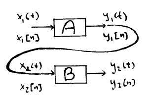

​		假设有系统A，它的输出是输入的动积分。（还记得刚才我们讲，阶跃和脉冲之间的关系式的时候讲过的动积分吗？如果这碰巧是一个脉冲，那么输出便将会是一个阶跃。）这个系统当然是被称为一个积分电路系统。积分电路系统事实上是一种可逆系统。它的逆系统是这样，输出是输入的导数。因此 如果系统A是积分电路系统，则其逆系统中，输出等于输入的导数，它被称作为微分电路。

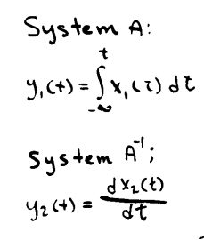

​		最后一种系统，这种系统中，输出与输入通过这条曲线相关联，输出等于输入的平方，这个系统就是我们之前讲过的平方电路，平方电路是无记忆系统。现在的问题是平方电路是可逆系统吗？如果已知某信号的平方，能算出信号是什么吗？这个问题的答案是否定的，因为很明显，根据其平方是无法推知信号是正还是负的。因此，平方电路是不可逆的。

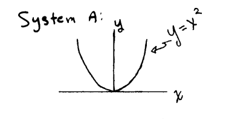

### 因果性		

​		现在 让我们继续来讲讲其他一些属性，接下来这个属性非常有用，在各种的课程讨论过程中，有时可以作为参考，也将起到非常重要的作用。该属性被称为<u>因果</u>属性。说一个系统是因果的，其中一种说法是<u>当你给予激励时 它才会作出响应</u>。另一种说法是 任何时间点上，<u>系统的响应只取决于该时间点之前的输入值</u>。

​		因此 因果系统中，无论是连续时间还是离散时间的情况都经常被定义成具备这样一种属性的系统，即 任何时间点上的输出只取决于 <u>等于或先于该时间点上的输入</u>。这就意味着该系统无法预见未来的输入，这实际上可能又是另一种对因果关系的定义，如果某系统不能预见未来的输入则该系统就是因果系统。

​		还有一种说法就是，对于某个指定的系统，假设有两个输入信号x~1~(t)和x~2~(t)，以及对应的输出信号y~1~(t)和y~2~(t)。在某个时间点t~0~之前，两个输入信号相同，两个输出信号相同；在t~0~之后，两个输出信号可能相同也可能稍有不同，那么该系统被认为是因果系统，因为因果系统的输出无法预见输入在未来某个时间点上会不一样。

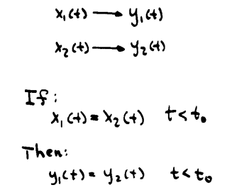

​		当然 我这儿写的是持续时间下的情况，相同的因果系统定义也适用于离散时间。

​		好了 让我们来看看一个例子，这是一个系统，下面的离散时间系统在任何时间点上 输出为x(n) x(n-1) x(n+1)之和的三分之一，而这其实是一个非常有用的系统，被称为滑动平均系统。那么这个滑动平均系统是因果系统吗？答案是否定的，假设求n~0~时刻的输出，它的输出与n~0~时刻之后的输入有关，因为包含x[n+1]这一项。

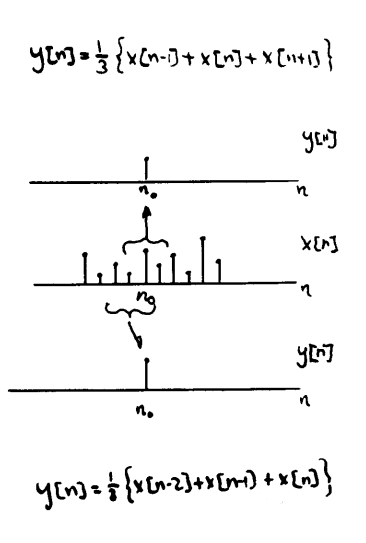

​		如果把该滑动平均系统的表达式改变一下，变为最下方的表达式，那么它就是一个因果系统。

### 稳定性

​		好了 现在让我们转向另一个系统属性，即<u>稳定</u>属性。稳定属性有很多定义，其中一些是数学上的 定义，而且很规范。但我们所选择使用的稳定属性的定义。叫做有界输出-有界输入的稳定性。本质上 该定义指的是，当且仅当 若输入有界则输出必有界 的情况下，系统是稳定的。
​		假设有一个系统，输入从不超过某个有限的值，那么 稳定属性就要求 输出也被限定在某些有界值范围内。
​		我们在之后比较后面的课程中会讲到反馈，我们会看到 反馈的非常重要的应用之一，就是用于稳定不稳定的系统。顺便说一下，它有一个问题，就是如果使用不正确它可以破坏稳定的系统。

​		假设有一个<u>积分电路</u>，我们给它输入一个阶跃函数或是阶跃信号，输出被称作斜坡信号，呈线性增加。现在的问题是斜坡是无界的吗？输入是有界的，阶跃输入是有界的，但斜坡是无界的。
​		因为试图给其设定任意界限的话，时间T值到了一定程度，输出总是会超越界的。因此 事实上积分电路是不稳定的。

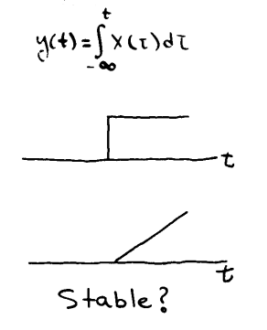

### 时不变性

​		最后 再来看这两个，我们将随着课程学习的深入大量用到的属性，<u>时不变性和线性</u>。
​		时不变性本质上说的是，原点是什么 系统并不在乎，换句话说，如果你取输入在时间上对其进行位移，则其输入 也会发生相应的时间位移。更规范一点讲，如图所示，如果在连续时间下，有一个输入x(t)，它产生输入y(t)，那么时不变性规定 如果输入发生了一定的时间位移则输出也发生相同的时间位移，这个同样完全适用于离散时间。

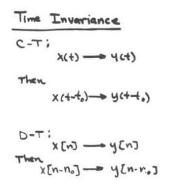

​		例如 请大家看我们这边展示的这个系统，这也是之前讲到的，从一个脉冲序列到一个阶跃序列的系统，我们把它称为动求和，实际上它也常被称为一个累加器。它的功能是累积历史输入值。那么 累加器是时不变吗？最好的证明方式，是通过方程式来验证它是否满足时不变的正式定义。

​		而通俗地说 直观的感觉会告诉你累加器是时不变的，因为如果将输入累加器的值延迟的话，那么输出的相关值也会产生同样的延迟。如果你让输入产生位移，它只管让输出产生相应的位移。

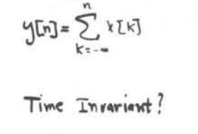

​		好了 这儿有另一个例子。它作为系统 是一个调制器，即输出是调制过的输入。如果输入产生时移 x( t-t~0~ ) ，那么它的输出是位移后的输入再乘以相同的调制函数的结果( sint ) x( t-t~0~ )。如果我们取某系统的输出 y( t-t~0~ )，其输入为x( t )，那么 它对应的是 sint( t-t~0~ ) x( t-t~0~ )。鉴于这两者并不相等，则这个系统不是时不变的。

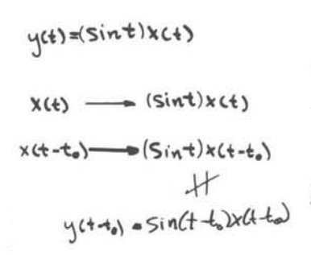

​		

### 线性

​		好 现在讲最后一个属性，<u>线性</u>属性。
​		连续时间和离散时间的情况下，线性属性的定义是相似的。假设有一些输入和相关输出，如x~1~(t)
和x~2~(t)，如果这些输出具有任意线性组合，相关输出也会具有相同的线性组合，那么可以认为该系统是线性的。

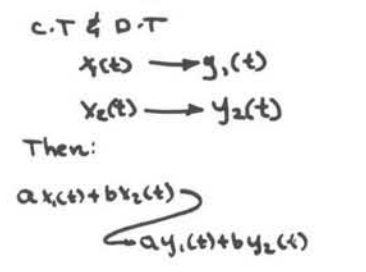

​		这里有一些例子

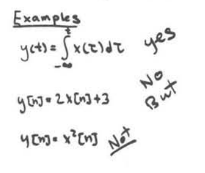

# 卷积

​		今天，我想着重讲一讲线性和时不变性，并讲解如何利用这些特性得出系统的一般表达式。

​		首先 我们来很快地回顾一下这两个特性。大家回想一下，时不变性是一种既适用于连续时间系统，也适用于离散时间系统的特性。

​		**时不变性**，它规定了任何给定的输入和输出之间的关系，如果我们使输入产生位移，则输出也会产生相应的位移。当然，这一表述也同样适用于离散时间系统。因此，<u>时不变性说明系统的当前状态与信号的起始时间无关</u>。

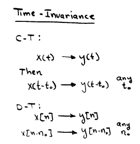

​		**线性**则是指，由一组已知输入产生一组关联输出，我在这里用Φk表示输入，用Ψk表示输出。那么线性特性规定，如果我们有这样一个输入，它是如下输入的线性组合，则输出是关联输出的线性组合。因此线性系统中输入的线性组合，所产生的输出也是关联输出的线性组合。

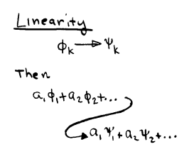

​		现在问题是，我们要如何利用，线性和时不变性？
​		我们在这门课的大多数时候多多少少会讲到一个基本方法，这个方法是尝试<u>把连续时间信号或离散时间信号分解成一组基本信号</u>。

​		我在这里进行了说明，问题是我们应该选择哪种基本信号？答案是 我们选择的这组基本信号，应该能在一定程度上为分析提供方便。因此 我们选择的这组输入，只需要经过简单的计算就能得到输出。当我们这么做的时候 可以看到，有两类输入特别适合这个方法。

​		第一类是**延时脉冲**，即把一个信号分解成一组延时脉冲的线性组合，从而得到线性时不变系统的表达式，通常称为<u>卷积</u>。

​		第二类是把输入分解为**复指数**，复指数的线性组合，通过我们所说的傅立叶分析，来表示信号和系统。我们在之后的几节课中会重点讲<u>傅里叶分析</u>。

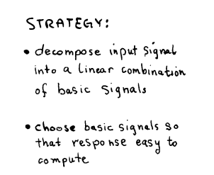

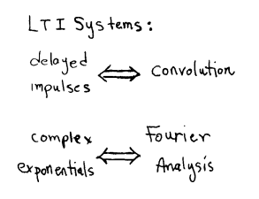

​		**那么我们先来学习，如何用脉冲信号得到系统的表达式，以及用卷积表达线性时不变系统**。

​		所以我们先来讨论离散时间信号，特别是如何将离散时间信号，分解成延时脉冲的线性组合。

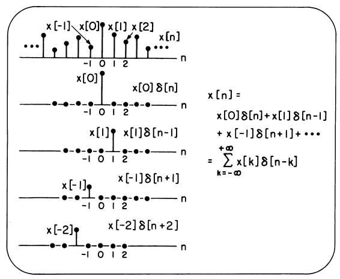

​		这里是一个一般序列值，我在序列顶部标出了几个值，我们可以参考用脉冲信号表示单位阶跃信号的做法，<u>把这个一般序列看成一系列延迟了的脉冲信号</u>，并且在相应的时刻出现相应的振幅。

​		因此我们可以把这个一般序列，看成这样一组脉冲信号：

​		第1组：一个脉冲信号 $δ[n]$，乘上相应的振幅，即 $x[0]δ[n]$

​		第2组：一个延迟为1的脉冲信号 $δ[n-1]$，乘上相应的振幅，即 $x[1]δ[n-1]$

​		第3组：一个延迟为2的脉冲信号 $δ[n-2]$，乘上相应的振幅，即 $x[2]δ[n-2]$

​		第4组：一个延迟为3的脉冲信号 $δ[n-3]$，乘上相应的振幅，即 $x[3]δ[n-3]$

​		像以上这样的**加权延时单位脉冲**，把它们全部加在一起，就能得到一个总的序列。

​		从代数角度来看，它对应的就是把各项相加的和来表示序列：

​		$x[n] = x[0]δ[n] + x[1]δ[n-1] + x[-1]δ[n+1] + ...$

​		或者用这个求和公式来表示序列：

​		$x[n]=\sum_{k=-\infty}^{+\infty}x[k]δ[n-k]$		

​		那么得到的这个表达式有什么用呢？它的用处在于将序列分解成了基本序列，也就是延时脉冲的一个线性组合。**如果我们讨论的是<u>线性系统</u>，这个线性组合所对应的响应就是，各个延时脉冲信号的响应的线性组合**。

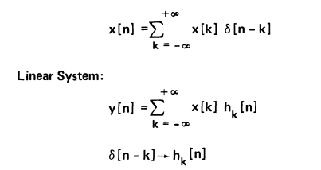

​		如果我们将某个延时脉冲的响应记为$h_{k}[n]$，输入$x[n]$对应的输出$y[n]$为：

​		$y[n]=\sum_{k=-\infty}^{+\infty}x[k]h_{k}[n]$

​		$x[n]$对应$y[n]$，$δ[n-k]$对应$h_{k}[n]$，$x[n]$仅仅是加权的系数

​		

​		因此这就是<u>线性系统</u>的表达式。

​		如果现在再加上一条，<u>系统是时不变的</u>，实际上 我们可以联系**各个延时脉冲信号对应的输出**进行讲解。具体来说 如果系统是时不变的，那么<u>K时刻的脉冲信号对应的响应</u>就和<u>0时刻的脉冲信号对应的相应</u>位移到k时刻 完全一样。

​		即$h_{k}[n]=h_{0}[n-k]$，$h_{0}[n]$是系统对 $n=0$ 时的脉冲信号的响应。

​		一般情况下，我们很少用$h_{0}[n]$，而是简写为$h[n]$，它就是系统的单位脉冲响应。

​		那么线性时不变系统的输出就这样来表示：

​		$y[n]=\sum_{k=-\infty}^{+\infty}x[k]h[n-k]$

​		$h[n-k]$是$n=k$时，脉冲信号对应的响应，通常将这个表达式称为**卷积和**。

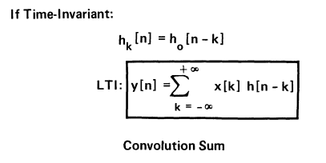

​		现在来强调下我们是怎么得到这个的。让我从另一个角度来解释下。当然 我们已经把序列x[n]
分解成这些加权延时脉冲信号的线性组合，当这些被叠加在一起时，就与原始序列x[n]相一致。

​		例如 如果第一个脉冲信号$x[0]δ[n]$能产生一个$x[0]h[n]$的响应，其中$h[n]$是$n=0$时单位脉冲信号的响应；第二个脉冲信号$x[1]δ[n-1]$产生这个加权延时响应……我们得到这些单个响应，将它们叠加起来得到的线性组合，就是最终的输出。
​		

​		实际上 这就是我们思考这个问题的方法。对于一个一般序列，我们分别考虑每一个单独的样本都作用于系统，由于线性特性，系统的响应就是这些单个响应的总和。
​		以上离散时间系统的情况。

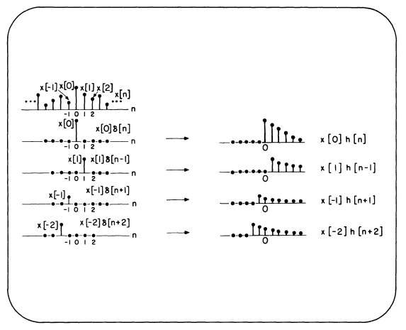

​		类似的方法也适用于连续时间系统。
​		特别地，在连续时间系统中，我们可以在一开始将一个连续时间信号分解成一系列任意窄的矩形，当这些窄矩形的面积趋向于0时，每个矩形基本上相当于一个脉冲信号。

​		这里是一个连续时间信号，我已经将它近似为一个矩形阶梯，因此实际上 我可以将它看成一系列单个矩形，它们的高与这个连续曲线的高度有关系。

​		把这个连续时间信号看成一连串的矩形的目的是，我们想用$δ_{Δ}(t)$这个函数来描述每一个矩形，进而描述整个连续时间信号。

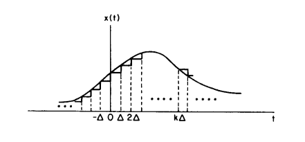

​		我将其中一个矩形画到下面来 例如这个脉冲信号对应的就是$t=-2Δ$和$t=-Δ$之间的矩形

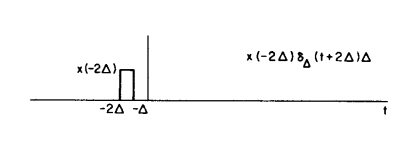

​		这是$–Δ$到0之间的矩形

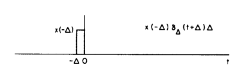

​		我们将波形上连续的波段，近似为一系列的矩形。

​		现在我们具体来看看这个矩形 ，例如从0到Δ的这个

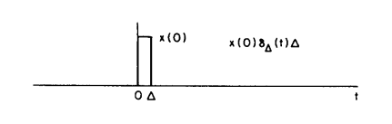

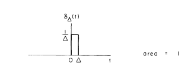

​		它的振幅是$x(0)$，那么我们有了一个高度为$x(0)$的矩形，$δ_{Δ}(t)$这个函数就是我们上次定义的，它的高度为$1/Δ$，宽度为$Δ$。最后乘以这个小小的Δ，那么 $x(0)δ_{Δ}(t)Δ$ 就是这个矩形的表达式。

​		进一步推广，任意一个 (第$k$个) 矩形的表达式为 $x(kΔ)δ_{Δ}(t-kΔ)Δ$ ，其中 $δ_{Δ}(t-kΔ)Δ$表示的是一个个矩形，高度为1，宽度为$Δ$，再乘以 $x(kΔ)$ 表示这个矩形的高度或振幅为 $x(kΔ)$ 。

​		

接着，我们就可以用线性组合的方式近似表示$x(t)$

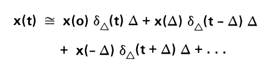

如果把它写成这种更普遍的形式，则为

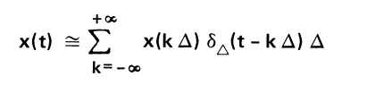

然而，事实上，这种方式并不能精确地描述$x(t)$，因为显然一串串的矩形并不完全与$x(t)$重合

那如果我们把$Δ$取得足够小，即$Δ\longrightarrow 0$，在极限情况下 $δ_{Δ}(t)$ 就变成了一个脉冲信号 $δ(t)$ 。我们用一个连续的变量 $\tau$ 来替代 $k\bigtriangleup $ ，用 $d\tau$ 来代替 $\bigtriangleup$ ， 因此 $δ(t-\tau)$ 代替了 $δ_{Δ}(t-k\bigtriangleup)$ ， $\int$ 代替了 $\sum$ 

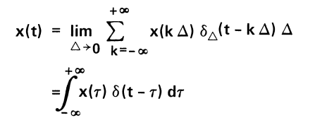

​	

​		现在我们得到的是一个积分式，它告诉我们x(t)是如何被表示为一个含有脉冲函数的总和或者线性组合的。顺便说一下 下面的这个方程经常被称为筛选积分，本质上它说的是如果将一个时间函数x(t)代入这个积分，当脉冲信号沿时间轴移动时，将会再次得到x(t)。

​		现在第一眼看去 它看起来像是我们已经有了一个时间函数x(t)，然后又以一个复杂的方式用它表示它自己 有人也许会问为什么要这么做？这要追溯到我们采用的方法，这么做的原因是我们想要利用线性特性，以加权延时脉冲的线性组合来表示时间函数，其实这个求和公式已经反映了以脉冲来表示的分解过程和将时间函数分解成脉冲函数的过程。

​		

​		现在 根据线性特性我们能明确认识到一个<u>线性系统</u>的输出是这些单个输入的响应的总和，所以$h_{kΔ}(t)$对应于$δ_{Δ}(t–kΔ)$的响应，其余部分$x(kΔ)$和这个小小的$Δ$基本上是**比例因子**。

​		同样地，当$Δ\longrightarrow 0$时，就对应着图中这样一个积分。$h_{\tau}(t)$ 对应在 $\tau$ 时刻产生的对应脉冲信号的**脉冲响应**，注意 $\tau$ 是一个连续时间变量，它的范围就是积分区间，即$-\infty$到$+\infty$。

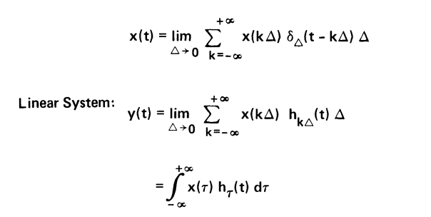

​		以上是线性系统的表示方法，同样地，我们再来做同样一件事，如果系统是时不变的，则对每一个延时脉冲信号的响应，仅仅是延时了的脉冲响应。

​		假设该系统对输入信号 $δ_{0}(t)$ 的响应为 $h_{0}(t)$ 。那么 $kΔ$ 时刻的脉冲 $δ_{Δ}(t–kΔ)$ 对应的响应就是 $h_{0}(t)$ 位移到 $kΔ$ 时刻，即 $h_{kΔ}(t)$ = $h_{0}(t-kΔ)$ 。当$Δ\longrightarrow 0$时，就是 $h_{\tau}(t)$ = $h_{0}(t-\tau)$ 

​		最后，就像我们之前做的一样，$h_{0}(t-\tau)$ 简写成 $h(t-\tau)$

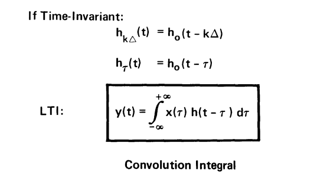

​		最终，得到的就是用积分式来表示的线性时不变系统，它告诉我们输出与输入，和脉冲响应之间的关系。

​		和讨论离散时间系统一样，我们再来快速地从另一个角度思考这个问题。大家想想我们已经把连续函数分解成各个矩形，然后每一个这种矩形分别产生一个单个响应，然后这些单个响应被叠加在一起。当我们讨论这一过程时，我们通过近似法用这些矩形来表示一条光滑曲线。

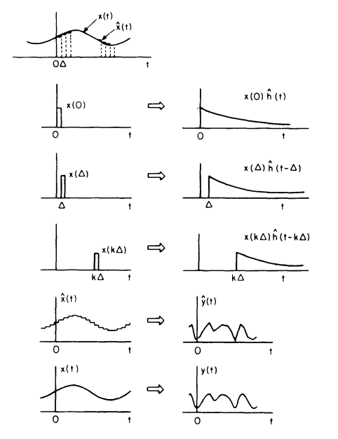

​		我们已经成功做到能利用线性和时不变性，将系统表示成0时刻的脉冲信号经过该系统后的响应。所以对于一个线性时不变系统，如果你知道它对一个在t=0或n=0时的脉冲信号的响应，就能根据离散时间系统的卷积和或者连续时间系统的卷积积分，得到对应于任意输入的响应。

​		我们需要频繁地提到卷积，所以用符号表示它会很方便，所以x[n]*h[n]表示的是x[n]和h[n]的卷积。相对应地 在连续时间系统中，我们有这个卷积积分。

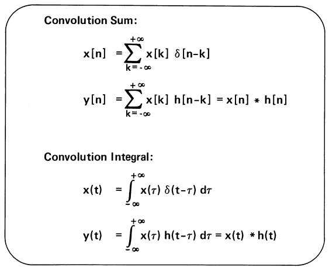

​		现在我们先停下来思考一下，对于离散时间系统，如果我们想求 $a$ 时刻该系统的输出，那么该时刻的输入为 $x[a]δ[n-a]$ ，注意这是一个**加权延时脉冲函数**，$n$ 为时间变量，范围是 $-\infty$ ~ $+\infty$ 这个函数或者说序列表示只有在 $a$ 时刻它的值为 $x[a]$ ，其它时刻为 $0$ ，那么整个系统在 $a$ 时刻的输出就是**加权延时脉冲函数**对应的响应$x[a]h[n-a]$ 吗？答案是否定的，因为这个系统有可能是无记忆的，那么 $a$ 时刻的输出就只与 $a$ 时刻的输入有关，也有可能是有记忆的、因果的、非因果的，那么 $a$ 时刻的输出还可能与其它时刻的输入有关。所以，我们需要把所有时刻的输入对应的响应叠加起来，才能万无一失地得到完整的输出。

总结一下：

​		$a$ 时刻的输入是一个函数，因为我们利用的 $δ[n]$ 的筛选性质，只有在 $a$ 时刻的函数值不为 $0$ ；

​		$a$ 时刻的输出是一个值。	

​		对于连续时间系统也是类似的。

现在又有一个新问题：

​		就离散时间系统而言

​		$y[n]=\sum_{k=-\infty}^{+\infty}x[k]h[n-k]$

​		如果要求它的输出 $y[n]$ 

​		$k=-\infty$		 $x[-\infty]h[n+\infty]$

​		...

​		...

​		$k=-3$		   $x[-3]h[n-(-3)]$

​		$k=-2$		   $x[-2]h[n-(-2)]$

​		$k=-1$		   $x[-1]h[n-(-1)]$

​	    $k=0$		     $x[0]h[n-0]$

​	    $k=1$		     $x[2]h[n-2]$

​	  	$k=2$		     $x[2]h[n-2]$

​	  	$k=3$		     $x[3]h[n-3]$

​	  	...

​	  	...

​	  	$k=\infty$		$x[\infty]h[n-\infty]$

​		就需要把所有的加权延迟脉冲响应叠加起来，最终得到的是一个序列。假如我要求 $n=a$ 时刻的输出，就直接从序列 $y[n]$ 中读出 $n=a$ 时的值。

​		如果我们最终只是想得到 $n=a$ 时刻的输出，把 $n=a$ 代入上面表达式

​		$y[a]=\sum_{k=-\infty}^{+\infty}x[k]h[a-k]=A$

​		那么怎么把具体的 $A$ 求出来呢？

​		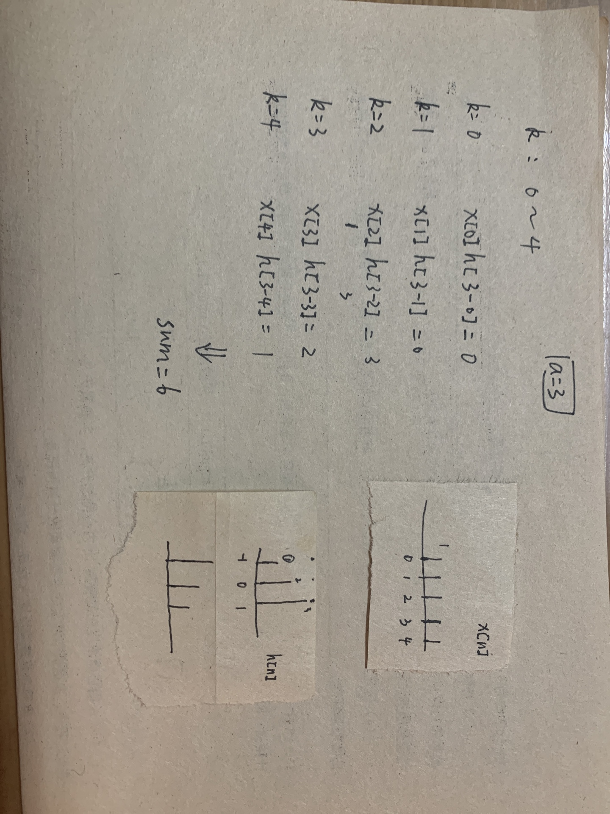

​		

​		这么做同样有些繁琐，那么有没有什么办法可以一步就算出 $n=a$ 时的输出呢？

​		先看这样一个例子：

​			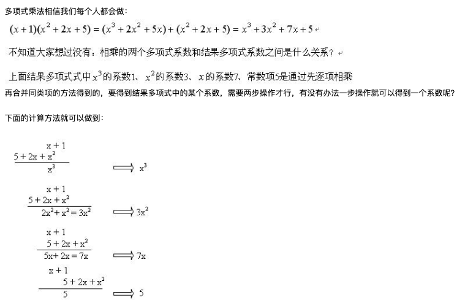		

​		这种计算方法总结起来就是:
​		**反褶**：一般多项式都是按x 的降幂排列，这里将其中一个多项式 的各项按x 的升幂排列。
​		**平移**：将按x 的升幂排列的多项式每次向右平移一个项。
​		**相乘**：垂直对齐的项分别相乘。
​		**求和**：相乘的各结果相加。
​		反褶、平移、相乘、求和，这就是通信原理中常用的一个概念 “卷积”的计算过程。

​		仿照上面所讲的方法：

​		已知输入 $x[n]$ ，单位冲击响应 $h[n]$ 

​		如果要求 $a$ 时刻的输出，先把其中一个序列 $h[n]$ 反褶得到 $h[-n]$，再平移 $a$ 得到 $h[-n+a]$ ，最后与 $x[n]$ 对应相乘再求和就能得到 $a$ 时刻的输出值 $A$

​		

​		这时候你就会发现，$x[n]$ 和 $h[-n+a]$ 与我们之前得到的表达式不是很相似吗？为什么我们不直接使用原来的公式呢。因此，可以把 $x[k]$ 和 $h[n-k]$ 看成 $k$ 的函数，而 $n$ 表示平移的单位。

​		$y[n]=\sum_{k=-\infty}^{+\infty}x[k]h[n-k]$

​		现在我们可以这样理解这个公式，对于特定时刻 $n$ 的输出，变量 $k$ 的作用就是在整个时域范围内逐一扫描，发现 $x[k]$ 和 $h[n-k]$ 有垂直对齐的项，就把它相乘，最后再求和。

​		这样做有什么好处呢？

​		卷积公式可以从两个角度去理解

现在我想谈谈很多关于卷积的内容
由卷积的性质
我们可以了解线性时不变系统的性质
而且要着重于实现卷积的技巧
这很重要
换句话说 要理解并熟练掌握
还要深刻理解这些特别的总和
与积分表达式的意思
让我们先来看看离散时间信号卷积
通过更具体地
研究这个总和
了解如何处理这个序列
那么回到我这里显示的卷积和的表达式
x[k] h[n-k]的求和公式
我们重点讲这个例子
其中x[n]为单位阶跃函数
h[n]为指数函数乘以单位价跃函数
那么这就是序列x[n]
序列h[n]在时间轴的正半轴呈指数曲线
在时间轴的负半轴为0
我们有了x[n]和h[n]
现在我们回去看看这个方程式 我强调一下
我们想要的不是x[n]或h[n]
我们想要x[k] 因为我们要针对k求和
我们要的并不是h[k]而是h[n-k]
我们通过x[n] 很直接地得到了x[k]
仅仅是改变了总和的下标
什么是h[n-k]？
那么什么是h[-k]？
h[k]反转过来就是h[-k]
所以如果这是h[k]
那么这就是h[n-k] 在本质上
卷积运算或者卷积技巧告诉我们的做法
就是将序列h[n-k]
即让h[-k]原来为k的这个点等于n
并将这个序列乘以这个序列
然后在k的负无穷到正无穷上对乘积进行求和
如果我们要计算 比如说 在n为0时的输出
就像我把序列放在这里一样 这里是n为0
我们将这个 乘以这个
然后在负无穷到正无穷上求和
或者在n为1时 我把它放在这里n为2时
或者我把它放在这里等等
那么 你们应该知道大致的想法了
我们来看一段动态视频
了解一个序列是怎样平移经过另一个序列的
以及输出y[n]是怎样积累成最终结果的
我们考虑的输入是一个阶跃输入
正如我这里显示的
并且我们要用这个脉冲响应
卷积一个指数衰减函数 为了得到卷积
我们要用x[k]乘以h[n-k]
而不是h[k]
相应的先得到h[k] 然后沿原点翻转它
然后进行适当位移
所以这里我们看到
n为0时的h[n-k] 即h[-k]
现在是h[1-k] 向右
移动一个单位就可以了
这里我们有h[1-k]
向右移动一个单位是h[2-k]
再向右移动一个单位是h[3-k]
现在让我们向左移动直到n为负值
然后我们开始卷积
这里是n=0 n=-1
n=-2及n=-3
现在为了构成卷积
我们想要对x[k] h[n-k]的乘积
在负无穷到正无穷上求和
对于n为负时 乘积为0
所以卷积的结果为0
随着我们向右移动 逐渐形成卷积
卷积的结果如底部轨迹显示所示
我们从n为负开始 这里我们有n为-1
我们在n为0时得到第一个非0项
现在我们再往右移 对应着n的增加
卷积和中的项的数目越来越多
逐渐形成卷积 特别在这个例子里
卷积结果是单调递增的
并渐渐接近一个常数 其实这个常数仅仅是
指数曲线下值的累加
现在让我们来实现卷积
这次用矩形脉冲的输入
而不是阶跃输入 这是脉冲响应
即衰减指数信号 所以我们还是
以这里显示的n为负的
h[n-k]开始 n为负时
乘积里还是没有非0的项 所以和先前一样
n为负时 卷积为0
随着脉冲响应沿时间轴移动
底部轨迹将显示卷积结果
n为0时 我们得到第一个非0项
当n增加到超过0
我们开始得到的输出
和用阶跃输入时产生的
输出基本上一样
直到脉冲响应达到某个值时
我们再往右移动
移到矩形不为0的区间之外
所以当我们将某个点从这里继续往前移动时
输出将会衰减 相应的
脉冲响应会移出输入不为0的区间
通过底部轨迹
我们现在可以看到卷积的结果
好了 你们已经看到的是一个
离散时间信号卷积的例子

现在让我们来看一个连续时间信号卷积的例子
正如你们所想 连续时间信号卷积的计算方式
和离散时间信号卷积一模一样
对于连续时间信号卷积
我们再次列出这个表达式
y(t)现在是 
x(Γ) h(t-Γ)的积分
它的形式和我们之前的
离散时间信号卷积的形式完全相同
实际上连续时间信号卷积的方法
是一样的
所以这里是我们的例子
x(t)等于单位阶跃函数
h(t)现在实指数函数乘以单位阶跃函数
这里表示的是x(t) 它是单位阶跃函数
这里是h(t)
它在正半轴上为指数函数 在负半轴上为0
我们再回去看卷积表达式
我们要的不是x(t) 我们要的是x(Γ)
我们要的不是h(t)或h(Γ)
我们要的是h(t-Γ)
我们打算把这些乘起来
然后对变量Γ求积分
从而得到任意给定时刻的输出
如果我们想要其他时刻的输出
我们将t作为积分里的参数 改变t的值
那么这里我们有x(t)
这里我们有h(t)
这并不是我们真正想要的
这里我们有x(Γ) 这没关系
它就是把x(t)中的t变成了Γ
那么什么是h(t–Γ)？
这里是h(Γ) 如果我们把它翻过来
就是h(t-Γ) 而h(t-Γ)的
位置在Γ等于t的地方
我们改变t的值 就改变了这个信号的位置
现在我们把这两个乘起来
h(t–Γ)位于t取值合适的地方
从负无穷到正无穷做积分运算
再次 大家真的最好看一下
这个例子的动态过程
通过观察这个卷积是如何形成的
来理解信号的反转
两个信号相向通过彼此的情形
以及相乘和积分概念
再次 我们考虑的输入是阶跃输入
我们用的脉冲响应
还是衰减指数信号
为了形成卷积
我们想要得到
x(Γ)与h(t-Γ)的乘积
而不是x(Γ)与h(Γ)的乘积？
所以我们要将h(t)沿时间轴反转
然后根据t的取值适量移动
我们先来看看h(t-Γ)
当t为正值时
对应于把h(t-Γ)向右移动
这里t在增加
这里t在减少
我们先从t为负值是开始进行卷积
对应于把h(-Γ)往左移
现在为了形成卷积 我们要这两者的乘积
t为负时对积分并没有贡献非0项
所以在t小于0时卷积为0
底部轨迹显示的是卷积结果
这里是t为负的
对于t小于0的 在卷积结果继续为0
随着t增加到大于0
卷积中开始出现非0项
这显示了卷积……
卷积的结果开始变化
随着t的增长 在被积函数中出现
越来越多的非0项
所以卷积的结果是
一个单调递增的函数
在这个例子中
卷积结果趋近一个常数
这个常数与脉冲响应曲线下的面积成正比
因为事实上我们是用它与阶跃输入
做卷积计算
现在让我们用矩形脉冲作为输入
来计算卷积
仍然用指数信号作为脉冲响应
为了形成卷积
我们需要x(Γ) h(t-Γ)
这里表示的h(t-Γ) t为负
为了形成卷积
我们计算这两者乘积的积分
t小于0时结果仍然为0
那么底部的轨迹显示的是卷积的结果
这里显示为0 它一直为0直到t为正
那时被积函数里开始出现不为0的项
现在随着我们往右移直到
脉冲响应移出不为0的区间之外
输出将会累积
但是当脉冲响应开始离开那个区间
输出将会呈指数衰减
随着t的增加
脉冲响应移得越来越远
输出将会呈指数的衰减
这代表在x(Γ)与h(t-Γ)的
乘积的面积将会越来越小
渐渐地这个输出将会接近0

好了 你们已经了解了卷积
你们已经了解了卷积推导
以及用图形表示卷积
最后让我们再来看看这两个例子
我们来分析一下这两个例子
以便我们最终可以看到对于这些同样的例子
我们是怎么分析得出结果的
第一个是离散时间的例子
让我们看这个离散时间的例子
我这里写的是卷积和的一般表达式
所以这就是我们之前的
卷积和的表达式
如果我们看这两个例子
在这个例子中输入是单位阶跃函数
和脉冲响应为实指数函数乘以
一个单位阶跃函数
我们用已知的输入代替x[k]
用已知的脉冲响应代替h[n-k]
输出是我们这里这个表达式
你们在书本上会经常碰到这个表达式
以及一些
更复杂的例子
当你对这些表达式求值时
一般来说你会发现这些信号
在不同区间内有不同的解析式
这其实就是我们这里的情况
让我们专门来看一下总和
我们首先观察到的是这个求和符号的上下限
随着阶跃函数为0或不为0
而改变
特别是如果我们最先考虑结果
较为简单的情况 即n小于0
当n小于0 时这个单位阶跃函数为0
当k大于n且n小于0时
如果k为正
则这个单位阶跃将永远不会不为0
另一方面当k为负时
这个单位阶跃函数永远不会不为0
或者总是为0
让我通过这些图形来作一下强调
这是单位阶跃函数u[k]
这是单位阶跃函数u[n–k]
对于n小于0时 这一点在这一点之前
这两者的乘积为0
这意味着这两者间没有重叠
也就是说当n小于0时输出y[n]为0
这种情况比较简单
n大于0时它的答案不像是0那么
直接简单
所以现在我们来看看
当这两个单位阶跃函数重叠时会发生什么
这将会对应于我这里所标的区间2
即n大于0的区间
如果我们回去看这个求和公式
现在积分和对应于
这个单位阶跃函数和这个单位阶跃函数
它们之间有重叠的情况
所以对于n大于0的区间2
我们有单位阶跃函数u[k]
u[n–k]是单位阶跃函数沿时间轴反转
然后平移n且n为正值后得到的函数
如果我们想要把这两者相乘
我们可以将乘积中的k取值为整数
一开始k=0对应于其中一个单位阶跃函数
最后k=n对应于另一个单位阶跃函数
所以从k等于0一直增加到k的值等于n
这两者之间都有重叠部分
好了 现在这意味着对于原来的求和公式
我们只需改变求和符号的上下限
就可以去掉里面的单位阶跃函数
现在上下限为0和n 求和项为αⁿ⁻ᵏ
我们之前有u[k]和u[n-k]
因为我们修改了求和上下限
就把它们去掉了
我们现在把αⁿ提到前面去
因为是对k求和而不是对n
所以我们只需把它提到求和符号外面去
现在我们得到了α⁻ᵏ
我们可以写成(α⁻¹)ᵏ
得到的结果就是y[n]
我们可以把y[n]写成
αⁿ乘以(α⁻¹)ᵏ对k从0到n求和
好了 问题是如何计算它的值
本质上它对应于几何级数中
一些有限数量的项 顺便说一句
这个求和公式会反复出现
你们应该把这个写下来 写在你们的背包上
写在你们的手掌上
或者其他任何只要能帮你记住它的地方
你们会发现在这门课中
随处可见它的影子
所以这个值得你们牢记
特别是 我在这里写的是
一个几何级数的和
βᵏ对k从0到r求和
这是1-βʳ⁺¹
这比求和上限多了个1
分母是1-β
这个方程式很重要
没有必要去推倒它
不管你怎么得到它 重要的是要记住它
我们可以把这个求和结果
代入我们刚刚得到的表达式中
那么我们接着来
求出总和的封闭解
那么我们回到刚刚得出的这个表达式
y[n]等于αⁿ乘以(α⁻¹)ᵏ
对k从0到n求和
这在刚刚的表达式里充当β的角色
就是我刚刚说的那个表达式 代入那个
代入那个求和结果
我们就可以将这个表达式写成这样
经过一些代数计算之后
我们得到的最后结果是
y[n]=1-αⁿ﹢¹/1-α
我就在这儿用一些点来表示
从这一步到这一步
需要一定的代数计算
我就留给你们在空余时间去做
去享受其中的乐趣了
那么我们现在得到的y[n]的表达式是
y[n]=1-αⁿ﹢¹/1-α
那是n大于0时的情况
之前我们发现当n小于0时结果是0
最后 如果我们用图解表示卷积和
就会得到这幅曲线图
第一个不为0的值出现在n为0时 高度为1
然后下一个不为0的值是出现在n为1时
高度是1+α
这个是1+α+α² 等等
在n趋于无穷大时
逐渐接近1/1-a
与我们得到的代数表达式
是一致的 当然 显然
它也与动画视频中的图解一致
那就是离散时间信号的例子
我们用投影片进行了图解
还用动画视频进行了演示
现在我们又对它进行了解析
现在我们来解析一下连续时间信号的例子
与我们刚刚讲过的过程
几乎是一样
我们先写出卷积积分的表达式
就是白板顶部的这个积分
记得我们的例子是
将x(t)定为单位价跃函数
将h(t)定为指数函数乘以单位价跃函数
当我们将它们代入表达式时
这个就对应于x(t)
而这个对应于h(t–Γ)
现在的问题和之前的差不多
就是积分内有两个价跃函数
其中一个沿时间轴向前平移
另一个沿时间轴向后平移
我们需要检查它们什么时候会重叠
当它们不重叠的时候 乘积当然是0
做任何积分都是没有意义的
因为被积函数是0
如果我们梳理一下
我们将区间1规定为t小于0
T小于0 这个单位价跃只开始于 Γ为0时
这个单位价跃 当t等于Γ及大于Γ时
也为0 当t小于0时
如果这个单位阶跃函数沿时间轴向前平移
而这个单位阶跃函数沿时间轴向后平移
则它们之间没有重叠部分
被积函数等于0
因此输出等于0
好 现在我们同样来看看
两个单位价跃函数有重叠部分的区间
这时 两个单位价跃
函数的重叠部分……
会告诉我们积分的区间
在此例中 当t大于0时
在区间Γ=0到Γ=t上
两个价跃函数有重叠部分
对于区间2 即t大于0时
我们又得到了这个表达式
在这个范围内
这个单位价跃函数和这个单位价跃函数的乘积
等于1
这样一来 积分的上下限
就不再是负无穷到正无穷
我们知道被积函数
只有在这个范围内是不为0的
看看这个积分 我们可以将e⁻ªͭ这一项
提到积分符号前面
正如我们在离散时间信号的例子也是这样做的
我们注意到在积分中有e⁻ª⁽⁻Γ⁾
这样就得到了eªΓ对Γ 从0到t上的积分
如果我们计算这个积分
就会得到这个表达式 最后用e⁻ªͭ乘以它
就得到了t大于0时的y(t)
我在底部表示的这个代数表达式
我们计算出了t小于0 结果为0
t大于0时
我们得出了这个代数表达式
如果我们这个代数表达式按时间函数进行描绘
我们发现对应的是一个呈指数特性的曲线
它从0开始以指数形式逐渐趋近于
值1/a
好的 我们已经用几种方式讲解了这些例子
其中一种是分析法
要熟练掌握卷积的计算方法
去做各种各样的例题肯定是必不可少的
不仅要通过图解去理解
而且要像我们这样分析理解
你们可以试着去解决
我在课程视频手册里提出的问题
下一节课将重点讲
卷积的一些一般特性
并演示线性时不变系统的这个神奇的
表达式是如何引出
线性时不变系统的各种特性的
我们会发现卷积的特性相当多
它会为线性时不变系统带来
非常有用的性质
谢谢大家

# 模拟与数字信号处理

​		在上节课中，我们讨论了线性时不变系统的表达式，即用卷积和表示离散时间系统，用卷积积分表示连续时间系统。

​		尽管推导过程比较简单，而实际上 结果却很神奇，因为它表明 对于线性时不变系统而言，如果我们知道系统对t=0或其他时刻的单位脉冲的响应，那么我们就能确定，它使用卷积对任意输入的响应。

​		在今天的课程中 首先，着重讲一下卷积的代数运算功能，我们会看到卷积有很多代数性质。
对于线性时不变系统而言，这些性质隐含了重要的结论
​		然后我们将讨论，通过卷积描述线性时不变系统的特性，并指出其他诸多系统特性与脉冲响应之间的关系。

​		我们先来回顾一下上节课中所得出的基本结论，也就是离散时间情况下的**卷积和**以及连续时间情况下的**卷积积分**。卷积告诉我们的是如何在**输出**与**输入**以及与**脉冲响应**之间建立关联。我们也运用图解法从本质上阐释了卷积的形成过程，即获取系统脉冲响应，将其翻转 并平移经过输入信号，它的位置取决于我们正在计算的卷积自变量的值。然后对于离散时间的情况 将两者<u>相乘后求和</u>；对于连续时间的情况 将两者<u>相乘后积分</u>。

​		现在 卷积作为一种代数运算，具有很多重要的性质。

​		其中一个性质是交换律，交换律的意思是，我们可以说x与h的卷积也可以说成h与x的卷积。它们的先后顺序并不会影响到输出的结果，对于离散时间情况下，表达式如下

​		$x[n]*h[n]=h[n]*x[n]$

​		回想求多项式系数的例子，任意一个序列反褶即可。

​		交换律同时也意味着，如果 $x[n]=u[n]$ ，$h[n]=\alpha^{n}u[n]$ ，二者卷积的结果与 $x[n]=\alpha^{n}u[n]$ ， $h[n]=u[n]$ 二者卷积的结果一致。

​		当然 连续时间情况下的表达式也是如此。

​		可见，交换性告诉我们卷积的运算顺序不会对卷积结果造成影响。

​		因为卷积的各种性质无论是离散时间还是连续时间都是同样适用的，因此我们在描述其性质的时候忽略自变量 $t$ 或者 $n$ 。如把交换律表示为：

​		$x*h=h*x$

​		现在来讲讲另外两个重要的代数性质，一个称之为结合律。

​		$x*(h_{1}*h_{2})=(x*h_{1})*h_{2}$

​		第三个重要性质称之为分配律。

​		$x*(h_{1}+h_{2})=x*h_{1}+x*h_{2}$		

​		因此 卷积满足交换律、结合律以及对加法的分配律，这三个非常重要的代数性质。现在我们看由这些性质可以得到怎样的结论，尤其对于线性时不变系统。

​		我们先来看一下交换律，假设有一个系统，它的输入为 $x$ ，脉冲响应为 $h$ ，鉴于运算满足交换律，这就相当于系统的脉冲响应为 $x$ 而输入为 $h$ 。因此，对于线性时不变系统而言，我们把哪个函数当做输入，把哪个函数当做脉冲响应并不会影响输出，即输入与脉冲响应的角色可以调换，而输出或系统不受影响。

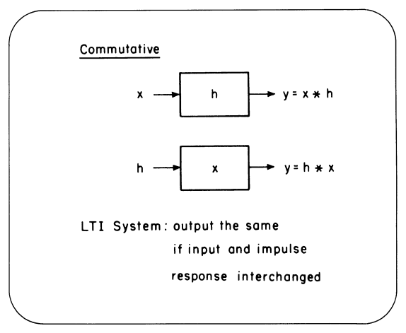

​		此外 如果我们将交换律，同结合律相结合的话，会有什么样的效果？如果我们有两个级联的线性时不变系统，整个系统不会受级联顺序的影响。
​		假设有两个系统级联在一起，一个含有脉冲响应 $h_{1}$ ，另一个含有脉冲响应 $h_{2}$ ，第一个系统的输出是 $x*h_{1}$ ，然后它作为第二个系统的输入，对应的输出是它与 $h_{2}$ 的卷积 $(x*h_{1})*h_{2}$ 。现在我们可以利用结合律来改写这个结果，改成 $x*(h_{1}*h_{2})$ 。现在我们就可以将其合并成一个系统了，输入为 $x$ ，脉冲响应为 $h_{1}*h_{2}$ ，输出为 $x*(h_{1}*h_{2})$ 。

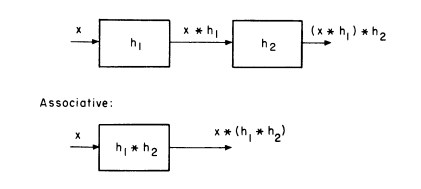

​		接下来 我们要应用到交换律。交换律是说我们可以将脉冲响应 $h_{1}*h_{2}$ ，也可以写成 $h_{2}*h_{1}$ 。由于卷积满足交换律，因此这些输出结果也是相同的。

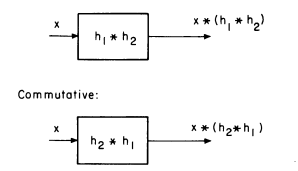

​		同样 我们可以再次运用结合律，$x*(h_{2}*h_{1})$ 等效为 $(x*h_{2})*h_{1}$ ，并将系统还原为两个系统级联的形式。

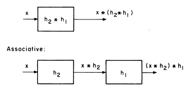

​		它的结果再次告诉我们，如果我们有两个级联在一起的**线性时不变系统**，那么我可以以任意顺序级联它们，结果是相同的。

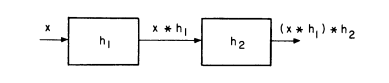

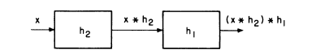

​		但如果系统不是线性时不变系统的话，那么 级联的顺序对于整个系统的而言就很重要了。举例来讲 如果一个系统做开平方运算，同时 另一系统对输入做增倍运算，则先开平方再倍增的结果与先倍增再开平方的结果不一样。

​		所以 这是线性时不变系统特有的一种性质，而且在深入课程内容时可供我们进行多次运用。

​		与系统互联相关的最后一个特性是是从分配律延伸出来的，它适用于**并联系统**。

​		对于并联系统，我们可以同时为 $h_{1}$ 和 $h_{2}$ 提供输入，然后将输出结果相加 作为整体的输出。运用卷积对加法的分配律，我们可以把它改写成 $x*(h_{1}+h_{2})$ 。
​		因此 对于并联的线性时不变系统而言，如果我们选用 我们可以使用单一系统替换原来的并联系统，其脉冲响应为原来那两个脉冲响应相加。

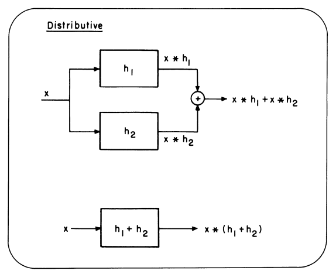

好 现在 对于线性时不变系统
我们得到了这个非常有用的卷积表达式
从目前课程内容中 我们可以看到
如何通过含有脉冲响应的
卷积与表达式
推导出与系统互联相关的简单而重要的结论
现在我要来讲讲其他系统特性
并且观察一下 对于线性时不变系统而言
其他系统特性
与系统脉冲响应的
特性或特质有怎样的关系
我们也会讲到各种特性
我们会讲到记忆性
以及可逆性
我们还会讲到因果性及稳定性
好的 我们先来讲一下记忆性
现在提个问题
系统脉冲响应对于线性时不变系统而言
隐含了什么样的结论？
还记得吧
我们总是假定系统是线性时不变的
如果系统具有或者不具有记忆性的话
会得出怎样不同的脉冲响应？
好 通过观察卷积特性 我们找到答案
这边 我们可以看到卷积积分
它表示x(τ)与h(t-τ)
是如何结合得出y(t)的
而上面我所给出的图示是个普通的例子
这是x(τ) 这是h(t-τ)
为了计算出任意指定的t时刻的输出
我们将二者相乘
并在-∞与+∞之间求积分

而其中的问题在于
我们如何定义h(t) 即脉冲响应
以便能够保证
输出只取决于t时刻的输入
好 从图中已经可以明显看出
如果我们只希望输出取决于τ=t时的x(t)
则h(t-τ)最好只在τ=t时为非零值
所以 结论就是
要使系统不具有记忆性
就要求h(t-τ)只在τ=t时为非零值
因此 我们希望脉冲响应
最好只在一点为非零值
我们希望求积和积分之后
能得到非零的结果
而实际的情况是
只有一种函数
能够满足所有条件 那就是脉冲函数
如果系统属于无记忆系统
那么要求脉冲响应是脉冲函数
其他脉冲响应 基本上
都要求系统具有记忆性
或者意味着系统具有记忆性
那么对于连续时间的情况来讲
无记忆性只对应于
与脉冲函数成正比的脉冲响应
在离散时间情况中 表述也是类似的
其中 输出同输入成正比
总之 无论是在连续时间
或离散时间情况中 都是如此
好 现在我们来重点看一下
系统可逆性方面的问题
回忆一下 系统可逆性的含义是什么
或者逆系统是指什么
逆系统是一种系统
用来与所求系统进行级联
整个级联结果就是个恒等系统
换句话说 输出等于输入
那么我们假定一个系统的脉冲响应为h
输入为x
比如说 它的逆系统的脉冲响应
是hi并且输出为y
那么 这个系统的输出就是 x*(h*hi)
并且我们希望这部分等于x
既然有此要求
这个卷积只需与脉冲函数相等即可
在离散时间或是连续时间情况中都是如此
在这些条件下hi就等于h的逆
顺便说一下 需要注意的是
为了方便书写
我们通常不将逆脉冲响应写作hi
我们用另外一种更方便更典型的书写形式
即h⁻¹而非hi来表示脉冲响应的逆
我们用它来表示逆脉冲响应
需要注意的是
不要把它曲解为h(t)或h(n)的倒数
这个符号所代表的是逆系统
现在 如果hi是h的逆
而h也是hi的逆
看似如此 或者说可能是这么回事
问题在于 如果你认为答案为是的话
那你又将如何去证明呢？
我把这个问题留给大家思考
答案是肯定的 意思是说
如果hi是h的逆
那么h也就是hi的逆
而揭开真相的关键在于
当我们对系统进行级联时
我们可以按任意顺序进行级联
好了 现在我们来讲另外一个系统特性
即 稳定性
同样 我们可以直接将这个特性
与系统脉冲响应的相关问题联系在一起
我们可以使用之前为稳定性下的定义
我之前将它定义为
有界输入 有界输出稳定性
换句话说
每个有界输入都有一个与之对应的有界输出
在此 我不打算展示具体的代数计算过程
大家可以去翻书看看
其中讲到线性时不变系统
有界输入和有界输出稳定的
充分必要条件
是脉冲响应
是绝对可和的
换句话说 如果你取绝对值
并在无穷区间内相加 结果是有穷的
或者 在连续时间情况中
脉冲响应是绝对可积的
换句话说 如果你对h(τ)取绝对值
那么积分结果是有穷的
在这些条件下 系统是稳定的
如果违反了这些条件
那么 毫无疑问 你会在课本中看到
系统是不稳定的
因此 稳定性也是于系统脉冲响应相关的特性
我要讲的另一个特性
就是因果性
在此之前 我想说一下预期结果
我们会在谈论因果性时用到它
即所谓的线性系统的
零输入响应
基本的结果
也就是非常有趣且有用的一个
那就是 对于线性系统而言
事实上 不论它是否是时不变的
如果你不为它输入内容
那就不会得到任何结果
因此 如果对于所有的t我们的输入x(t) 都为0
并且如果该系统的输出为y(t)
如果输入一直为0
那么输出同样也一直为0
对于连续时间系统是这样
对于离散时间系统而言也是这样
事实上 结果可以很直接地呈现出来
我们可以运用卷积
当然 这会涉及到线性
以及时不变
而实际上 我们可以
用相对简单的方法讲解这一特性
即 对于线性系统
我们知道 如果我们有一个输入x(t)
和一个输出y(t)
那么 如果对输入进行缩放
那么输出也会相应缩放
我们可选用比例系数a=0
这样就表明
不输入就没有输出
由此可以得到有关因果性的
非常重要的结论
尽管它很重要
但要强调的是
显然并非每个系统都有这一特性
即 没有输入就没有输出
举个简单的例子 比如电池
并未和任何东西相连
输出电压是6V 不管输入电压是多少
对于零输入而言 却没有得到零响应
这是线性系统的特有性质
好 我们现在来看看因果性的含义
大家记住 因果性指的是
系统无法预期到输入
这就是因果性的基本含义
我们之前有讲过
我们用多种方法对它进行了定义
其中一种表述是
如果两个输入在到达某时刻之前是恒等的
那么这一时刻之前的输出也必然是恒等的
原因显而易见 如果系统存在因果关系
则它自身无法预期未来的状况
它无法预测这两个恒等的输入
是否会在随后的某时刻发生相对的变化
那总的来说 因果性的表述是这样的
对于连续时间或离散时间系统都是这样
现在我们来看看它对于线性系统的意义
对于一个线性系统
相当于 或是可以转化为的
这样一个表述形式
即 如果t小于t₀时x(t)=0
那么t小于t₀时 y(t)也必定为0
因此 这意思就是说
对于存在因果性的线性系统来说
它必定满足初始松弛条件
即 在没有输入之前 系统不会作出响应
也就是 在输入变为非零前
系统是初始松弛的
那么 为什么这样说呢？
为什么这是线性系统的因果性的结论？
理由是
我们知道 没有输入就没有输出
如果t小于t₀时 我们有了一个为0的输入
且系统无法预期
那个输入是否会从零变为其他的值
那么 系统必定会生成一个为0的输出
直到过了那个时刻
遵循的原则是
如果两个输入在某时刻之前是恒等的
那么在这一时刻之前的输出必定也恒等
那么 这个针对线性系统的基本结论
本质上是对线性系统的表述
若输入为零 则输出为零
这就告诉我们 如何解释……
或者说 如何解释线性系统的因果性
现在 我们来看一看线性时不变系统
实际上 我们可以在这一点上深入
尤其对于线性时不变系统
其具备因果性的充分必要条件是
在连续时间情况中
t小于0脉冲响应为0
或是在离散时间情况中 n小于0时脉冲响应为0
因此 对于线性时不变系统而言
因果性等效于脉冲响应
一直为0 直到t或n等于0
要证明这个命题成立
首先考虑
为什么能由因果性可以推出这个结果
这一点成立的原因很明显
即 当t小于0时 脉冲函数为0
之前我们所看到的是
对于任意线性系统 因果性要求
如果某时刻前的输入为0
那么该时刻前的输出必定为0
以上证明了必要性
为了证明充分性
也就是说
事实上 如果脉冲响应满足了条件
那么系统就存在因果性
在这里我就不细讲了
这本质上可以归结为一种认知
即 在卷积和或卷积积分中
事实上 在脉冲响应方面
如果条件得到满足
那么 在离散时间情况中求和上限变为n
并且在连续时间情况中积分上限变为t
事实上 这表明
只有从-∞直到n时刻的输入值
才被用于计算y[n]的值
对于连续时间情况下的y(t)也是如此
好 我们已经了解了 脉冲响应是如何……
或者说 如何将线性时不变系统的
某些系统特性
转化为对线性时不变系统的
脉冲响应的各种要求
因为脉冲响应体现了系统的完整特性
我们来看几个特例
以便更进一步深化思想
我们先从之前接触过的一个系统开始
也就是一个累加器
回想一下 一个累加器输出为y[n]
是对从-∞到n的输入的累加值
现在 你已经在上节课中看到了
或是在上节课的视频教学手册中看到
累加器是一个线性时不变系统
事实上 它的脉冲响应
就是脉冲函数的累加值
也就是说 脉冲响应相当于一个阶跃函数
那么 我们要回答的是
了解脉冲响应的具体形式
了解累加器具有哪些特性
我们先来从记忆性开始
看得出 脉冲响应
并不是一个简单的脉冲函数
事实上 它是一个阶跃函数
而这表示什么呢？
这表示 系统存在记忆性
第二个 当 n小于0时 脉冲响应为0
这表明系统具有因果性
最后 如果我们在-∞到+∞区间内
对脉冲响应的绝对值求和 这是一个阶跃信号
如果我们在无穷区间内对那些值进行累加
事实上 得到的就是∞
那么 这就表明累加器不具有
有界输入有界输出稳定性
现在 我来讲讲其他一些系统
不过 既然讲到了累加器
我想让大家注意一点
这在今后的课程中会经常提到
那就是 我们可以改写累加器的方程式
差分方程
实际上我们可以将输出
写成k=-∞到n-1之间的累加值
加上x[n]
事实上 如果这样做了
这部分相当于y[n-1]
因此 我们可以将这个差分方程改写为
y[n]=y[n-1]+x[n]
因此 输出就是之前计算出来的输出
再与输入相加
这样的表述相当于
递归式的差分方程
而且 在下节课中
差分方程是着重讨论的部分
那么 累加器是否也存在逆系统呢？
实际上 答案是肯定的
我们来看一下累加器的逆系统
累加器的脉冲响应是一个阶跃函数
要求它的逆系统
我们需要知道 这个系统是否是
我们将累加器与之进行级联的系统
我称之为累加器的逆系统
它们级联后得到的输出是否是脉冲函数
我们看到
累加器的脉冲响应是一个阶跃函数
我们要将阶跃信号输入到某个系统中
并输出一个脉冲函数
事实上 大家回想一下
我们在讲阶跃函数和脉冲函数时讲到
其实 脉冲函数
就是单位阶跃函数的一阶差分
我们有一个差分方程可以为我们描述
脉冲函数与阶跃函数之间的关系
如果这个系统的形式是这样
那么输出就是脉冲函数
因此 如果我们把x2[n]作为输入
并且y2[n]作为输出
那么逆系统的差分方程
就是我所指的这个
如果我们想知道它的脉冲响应
只要看输入脉冲函数后得到的响应
直观的表述法是
δ[n]这是脉冲输入减去δ[n-1]
等于逆系统的脉冲响应
因此 我将其写为h⁻¹[n]
现在 我们知道累加器存在一个逆系统
这就是那个逆系统
你可以验证记忆性 稳定性 因果性等
你会发现 系统存在记忆性
逆累加器 是稳定的 也存在因果性
另外 还可以发现一个有趣的现象
尽管累加器是个非稳定性的系统
累加器的逆系统却是一个稳定的系统
总之 如果系统稳定
它的逆系统不一定稳定 反之亦然
这也同样适用于因果性
好 还有很多其他的例子
可供我们讨论
让我先来讲一个例子
就是我在这里给出的差分方程
我们下节课会详细讲解这方面的内容
我们会对这方面进行深入讨论
即常系数线性差分方程与微分方程
这个和那部分内容相合
此外初始松弛条件就位之后
相当于 响应一直为0
直到输入变为非0值
脉冲响应为aⁿu[n]
在视频教学手册中
大家一起来思考一下
该系统是否具有记忆性
是否具有因果性 以及是否稳定
同样 对于常系数线性微分方程
我在此特别指出的
在假定初始松弛条件下
脉冲响应为⁻²ͭu(t)
同样 在视频手册中
请大家检验一下系统是否具有记忆性
是否具有因果性 以及它是否稳定
好 我提到过 在下节课中
我们将详细讨论
常系数线性微分及差分方程
在本节课中 我所要讲的最后一个内容
是以一种完全不同的方式运用卷积的概念
来帮助我们解决之前略微提过的一个问题
具体来说
就是如何处理某些
与脉冲和阶跃函数相关的数学难题
现在 我先对这个问题做下说明
举个悖论的例子
在处理脉冲函数及阶跃函数的时候
你可能会遇到
首先 我们考虑一个恒等系统
那么输出和输入是恒等的
同样 我们的讨论对象
可以是连续时间系统 也可以是离散时间系统
我们知道 要使某个函数
卷积一个信号后仍然得到原来的信号
这个函数必须是脉冲函数
也就是说 恒等系统的脉冲响应
是一个脉冲函数 这是符合逻辑的结果
此外 如果我将两个恒等系统级联
我给系统一个输入
则第一个系统的输出与输入相等
而第二个系统的输出也与输入相等
换句话说 如我有两个级联的恒等系统
那么整个级联结构同样是一个恒等系统
换句话说 整个系统也是一个恒等系统
而得到的结论是
这个的脉冲响应是一个脉冲函数
这个的脉冲响应是一个脉冲函数
二者的卷积同样是一个脉冲函数
因此 对于连续时间系统而言 我们所需要的是
脉冲函数与自己的卷积是一个脉冲函数
对于离散时间系统也是这样
在离散时间情况里
我们没有什么特别的问题
如果你将它们卷积到一起的话
这是一种非常直观的数学运算
因为离散时间脉冲函数
具有非常明确的定义
然而 在连续时间情况里
我们需要注意脉冲函数的定义
因为它阶跃函数的导数
而阶跃函数具有间断性
你无法在间断点处求导
而我们的处理方式
就是将间断点扩大
使间断发生的时刻变为一个有限的时间区间
这样做了以后
我们便完成了对脉冲函数的定义
这是该函数的极限形式
是一个宽为Δ 高为1/Δ
面积为1的矩形
现在 如果我们将这个信号与它本身卷积
脉冲函数为这个极限形式
则这个函数与其自身的卷积是一个
宽为2Δ 高为1/Δ 面积为1的三角形
换句话说 这个三角函数
是δΔ(t)*δΔ(t)的近似结果
这个的极限
相当于恒等系统的脉冲响应
与其自身的卷积
其结论就是 不仅上面这个函数
也就是这个函数的极限形式对应于脉冲函数
而且这个的极限形式也对应脉冲函数
那么 有人会问
脉冲函数是什么
是这个极限 或是这个极限
除此之外
那么这里的建议是
在极限形式中 你一般不会遇到矛盾的情况
只要你不再在矩形
与三角形之间进行区分
如果你考虑将脉冲函数
输入微分器中时的情况
那么事情只会变得更糟
而微分器是一个非常常见的系统
此外 假设我们有个系统
其中 输出是输入的导数
那么 如果我们输入x(t)
那么就会得到dx(t)/dt
如果我输入一个脉冲函数
那么如果我谈到脉冲响应
那会是什么呢？
当然 问题在于
如果你认为脉冲本身的表现非常恶劣
那么它的导数又是怎样的呢
导数不仅无穷大
而且有一个正向脉冲函数
和一个负向脉冲函数
并且二者的面积之差
保持不变
而你也会因诸多困难而告终
形式上的方法
是通过一套数学运算
称为广义函数
我们不会过于形式化
不过我至少会暗示这种形式的本质
而它的确可以帮助我们
解释脉冲和阶跃函数
以及这类的函数
它的本质是对阶跃和脉冲函数的导数
进行操作型定义
具体如下
通常 当我们谈到函数时
我们所指的是函数在某时刻的值
当然 脉冲函数的问题在于 它是无穷大的
宽度为零 并且面积保持不变等
我们可以用到的
是它的操作型定义
操作型定义不会对脉冲函数的含义
进行解释
而是解释脉冲函数在卷积操作下的行为
那么 什么是脉冲函数？
脉冲函数用于在卷积过程中
使被卷积的另一个函数保持不变
而这个可以作为脉冲函数的定义
好 我们来验证一下我所说的
假设我们现在要谈谈脉冲函数的导数
我们要了解的是它的操作型定义
那如果我们有一个微分器
那么我们所求的是它的脉冲响应
我们就把它定义为u₁(t) 好了
u₁(t)函数的重要性
不在于它在每个时刻的的值
而在于它对卷积所起到的作用
它对卷积的作用是什么呢？
这么说吧 微分器的输出
是输入与其脉冲响应的卷积
而u₁(t)对卷积的作用就是微分
这就是操作型定义
现在 我们当然可以进一步想到
我们不仅要考虑对一个脉冲函数进行微分
而且我们也要考虑
对脉冲函数的导数进行微分
将得到的结果记为函数u₂(t)
使用u₂(t)因为我们将这个函数与它自身卷积
即u₁(t)*u₁(t)
而u₂(t)的操作型定义是什么呢？
它的定义是 当你用它和x(t)卷积时
你会得到这个二阶导数
好了 现在我们可以再深入一下
接着来讲讲对u₁(t)执行更多次自卷积的结果
事实上 如果我们考虑将u₁(t)自卷积k次
那么从逻辑上讲 我们会将其定义为uk(t)
同样 我们使用操作型定义加以解释
而操作型定义是通过卷积实现的
这对应于以uk(t)
作为k个微分器级联构成的系统的脉冲响应
那么 操作型定义是什么？
很简单 就是x(t)*uk(t)=dᵏx(t)/dt
现在我们得到了一组所谓的奇异函数
从数学角度来看
表现非常恶劣
但我们看到 如果使用操作型定义
它可以有很好的定义
当k无增长时
相当于我们之前提到的冲激
因此 当k趋于零时 相当于δ(t)
为了彻底讲清楚 我们还要试试其他方法
这次要讲讲积分器链的脉冲响应
而非微分器链的脉冲响应
当然 单一积分器的脉冲响应
是单位阶跃函数
两个积分器合起来的脉冲响应
就是单位阶跃函数的积分 等等
这同样对应于
一组奇异函数
如果我将m个积分器级联
那么它的脉冲响应就表示为u-m(t)
例如 如果是一个积分器
u₋₁(t)对应的是我们的单位阶跃函数
之前有讲过
u₋₂(t)对应的是单位斜坡函数 等等
事实上 这里选择负的参数
表示沿一个方向的运算 即积分
是为了区别于 用正的参数表示
沿另一个方向的运算 即微分
此外 我们知道对于u-m(t)
操作型定义是第m个运行的积分
同样 带有正值下标的uk(t)
其操作型定义 也就是导数
也就是dᵏx(t)/dt
作为结果的一部分
我们取uk(t)与ul(t)的卷积
结果就是 这个奇异函数
带有下标k+l
这决定了下标值是正值
或是负值
那么 来总结一下最后这个讨论点
我们使用了操作型定义
讲解了脉冲函数的导数与积分
从这又引出一系列奇异函数
我称之为奇异函数
以二阶冲激为例
但通过卷积进行操作型定义
让我们至少可以在操作层面上进行定义
否则 这些函数的行为非常恶劣
好了 在本节课以及上节课中
多数时间里
我们的讨论重点在于线性时不变系统
总的来说
我们通过运用卷积了解了有关它的很多特性
以及表达方式
还有许多与脉冲响应相关的性质
下节课中 我们将重点讲解
这些系统的一个非常重要的子类
即那些在离散时间情况中
可以使用常系数线性差分方程
进行描述的系统
以及在连续时间情况中
使用常系数线性微分方程进行描述的系统
这些系统并没有囊括

线性时不变系统中的所有系统
但却是非常重要的子类
我们下回会重点讲解这些内容
谢谢大家

# 采用微分差分方程表示系统

对下列内容的授权基于知识共享许可协议
您的支持将有助于麻省理工学院公开课程
继续提供优质的免费教育资源
如有意捐献或浏览学院的其它诸多课程资源
请访问麻省理工学院公开课网站ocw.mit.edu
在过去几讲中 我们导出了
线性定常系统的表达式
其中涉及一系列
非常重要的线性定常系统
在连续时间情况下
用常系数线性微分方程来表示它们
在离散时间情况下
用常系数线性差分方程来表示它们
举例来说 有个电路
它由电阻 电感和电容组成
也许还有运算放大器
对应于微分方程所描述的系统
同时 由弹簧和减震器
组成的机械系统
也用微分方程表示 而对于离散时间情况
像移动平均过滤器
数字过滤器以及大部分的简单数据平滑
都是用常系数线性差分方程表示
大概在此前的课程中你曾经接触过
连续时间系统的微分方程
并使用特解
齐次解以及初始条件等求解
之后我们会讲到
傅立叶变换的概念
然后讲到拉普拉斯变换
我们将会看到一些非常有效和有用的方式
来对微分和差分方程进行求解
在这一点上 我只想介绍
常系数线性微分方程
及离散时间情况下的常系数线性差分方程
然后再讨论它们对应及不对应
线性定常系统时的问题
首先我们考虑一下我们称作
N阶常系数线性微分方程
正如我这里显示的 它是
系统输出y(t)的导数的线性组合
等于系统输入x(t)的导数的线性组合
当然我们一般把它称作常系数方程
因为系数是不变的
换句话说 就是它不随时间变化
而它又是线性的
因为它对应的是这些导数的线性组合
而不是因为它对应于一个线性系统
事实上我们一会儿会看到 我将给大家演示
这个等式可能是也可能不和线性系统对应
在离散时间情况下
对应的方程
是常系数线性差分方程
而这个方程表示为
延时输出的线性组合
等于延时输入的线性组合
这个方程就叫做N阶差分方程
N是指相关输出的延迟个数
和N阶微分方程相似
N或方程的阶数
是指输出的导数的数量
首先我们从
常系数线性微分方程讲起
微分方程求解的
基本理论是
如果我们已经得到了一些解
我这里指的是yi(t)
即方程对应于给定输入的解
然后我们可以在那个解上添加任意
满足此齐次方程的解
所以事实上这个微分方程本身
并不是系统的唯一表达式
如果我求出了一个解
我可以把这个解
和满足齐次方程的解相加
这两个解之和也是一个解
这可以通过下面这个非常直接的方法进行验证
即把特定的
齐次解之和
代入微分方程
你将看到齐次部分
变成了零
这也正是齐次方程的定义
常系数线性
微分方程的齐次解
就是幻灯片下边这个公式
它是N个复指数之和
方程本身尚未确定常数的值
而且这种形式的齐次解
其实没办法对齐次方程进行检查
如果我们假设齐次方程的解
是一个含不定振幅
和不定指数的复指数
如果我们将它代入齐次方程
我们最终得到的方程是这样的
因子A和eˢᵗ都可以消掉
我们发现有N个s值满足这个方程
所以无论这些系数怎么变化
这些根都是正确的
由此得到的重要结论是
我在之前讲到的
这个形式的齐次解
也就是N个复指数之和
其中的N个系数
即每个复指数前的系数
是不确定的或未指定的
所以这就是说 为了求得
常系数线性微分方程的解
我们需要一些辅助信息
来确定N个未知常数
有各种各样的方法来指定
这种辅助信息或者说辅助条件
例如 作为对微分方程的补充
我可以告诉你 当t=t0时
输出的值以及它的N-1阶以下的导数
所以这个微分方程
加上这个辅助信息
即初始条件 我们就可以求解了
也就是说你能确定
刚开始在齐次解中不确定的系数了
根据辅助信息的描述方式
或者可以得到哪些辅助信息
该系统可能会也可能不会对应于线性系统
可能会也可能不会对应于一个线性定常系统
它对应于线性系统的一个最基本的条件是
初始条件必须为零
而且大家都知道原因
如果我们回顾一下前面讲座的内容
对于线性系统
如果我们输入0我们得到的也是0
所以如果x(t)
即输入是零 输出必然也是零
因此 这其实告诉我们
成为线性系统的必要条件
就是初始条件必须为零
除此之外 如果我们希望系统
是因果线性系统或因果线性定常系统
这需要初始条件
和我们所说的初始松弛一致
初始松弛的意思是 输出的结果必须是零
直到输入变成非零时
我们可以看到
这和我们之前讲过的
因果关系的概念相符
这样我们可以相对直接地看到
如果系统是因果线性定常系统
就要求满足初始松弛条件
这在某种程度上较难看到
如果我们指定初始松弛
这样其实就足以肯定
该系统既是因果的又是线性定常的
但关键的一点便是
线性和因果关系都需要初始松弛
好的 我们来看一个例子
我们看一下这个一阶微分方程的例子
这边我已经写出来了 这是个一阶微分方程
dy(t)除以dt加上ay(t)等于输入x(t)
首先我们来看看
这个方程的齐次解
我们可以考虑这个齐次方程
即输入为0时
方程的特解
我们猜测或强制给它一个这样的解
齐次解是一个振幅因子
和一个复指数的乘积
把它代入齐次方程
我们就得出这样一个方程
大家可以看到 在这个方程中
我可以消掉振幅因子
和这个复指数
所以在方程两边消掉这两项
现在剩下的
这个方程规定了复指数的形式
尤其是对于齐次解
那就是s必须等于-a
所以齐次解就是 我这儿已经写出来了
好 现在我们来看看有特定输入的解
假设 这个方程的输入是一个阶跃函数
就求解的细节我就不再讲了
你可以利用以前课上讲过的内容
大家应该知道怎样对它求解
我这里已经写出了一个含阶跃输入的解
两个数的比乘以1减去一个指数
再乘以一个单位阶跃
可以对它进行验证
只需将它代入微分方程
现在我们知道有一个通解
换句话说 任何一个解再加上齐次解
就又成为一个新解
所以考虑到我刚才说的这个解
我们得到了一个通解
仅是通过为它加上一个齐次解
这个对应的就是方程的通解
到目前为止 常数A的值还不确定
需要通过一些辅助条件来确定A的值
现在有一类辅助条件就是初始松弛的条件
正如我之前说的 初始松弛就是说
系统是因果线性定常系统
这样一来 对于初始松弛条件
就需要上面这个方程中的
这个常数为零
那么如果系统是因果线性定常的
那么
阶跃函数的响应就是这个式子
即一个常数乘以1减去指数函数乘以阶跃函数
如果系统是一个线性定常系统
我们知道 可以用它的脉冲响应来描述它
在之前的视频课程中大家已经笔算出了
线性定常系统的脉冲响应
即阶跃响应的导数
就想快速提醒大家一下解的来源
本质上我们可以考虑
两个级联的线性定常系统
一个是微分器 另一个就是
用微分方程所描述的系统
在这里输入一个阶跃信号 产生一个脉冲信号
作为系统的输入 然后输出脉冲响应
考虑到二者都是定常系统的事实
而且它们可以以任意顺序级联
如果阶跃信号作用于系统后产生了阶跃响应
当阶跃响应通过微分器
那么出来的必定是脉冲响应
所以对阶跃响应进行微分
我们就得到了脉冲响应
这个也是一个阶跃响应 我们刚才对它求过解
这次是一个单位阶跃函数
如果进行微分
因为阶跃响应是两项的乘积
那么乘积的导数 就是所有项的导数的和
通过代数计算后
由于阶跃函数的导数是个脉冲函数
这就是我们得出的脉冲响应的最终表达式
然后认识到 这是一个时间函数乘以脉冲函数
我们知道 一个时间函数乘以一个脉冲函数
仅当脉冲信号出现时有值
因此这一项为零
那么脉冲响应的最终表达式就是这个指数函数
当t为正数时 这个指数函数是衰减的
当t为负时 这个指数是递增的
回想一下我们之前说过的
一个线性定常系统是稳定的
前提是它的脉冲响应是完全可积的
在这种情况下
这种脉冲响应是完全可积的
只要指数因子a大于零
好的 现在我们看到的就是系统的脉冲响应
它由常系数线性微分方程表示
作为附加条件
我们指定了因果关系 线性 定常
主要是使用初始松弛条件
差分方程的解法
和微分方程的解法
基本相同
再让我提醒你
N阶常系数线性差分方程的形式
这儿这个式子
仍然是延时输出的
线性组合
等于延时输入的线性组合
这个差分方程
并不是系统的完整表达形式
因为我们可以向响应添加任意齐次解
也就是任意满足齐次方程的解
它们的和还将满足最初的差分方程
所以如果有一个特定的响应
可以满足差分方程
然后向它添加任意一个
满足齐次方程的解
得到的也是总方程的一个解
而齐次方程的解的形式
还是指数函数的线性组合
这儿有一个齐次方程
和解微分方程一样
我们可以猜测或假设一个解
它的形式是A乘以一个指数
把它代入齐次方程
然后我们得到了这样一个方程
大家可以看到 A即振幅 z的n次方
这个指数因子就消掉了
因此只要z的值能满足下面这个方程
它就能满足上面这个方程
并且有N个根 即z₁到zN
所以齐次解的最终形式
是N个指数函数的线性组合
N指的是这个方程的阶数
所有的指数函数的振幅因子
都是不确定的
都需要以某种方式来确定
通过设定适当的
初始条件或边界条件
所以差分方程的解的一般形式
就是指数函数的和再加上任意一个特解
我们需要一些辅助条件来确定这些系数
假设我们有N个待定系数
那么我们就需要N个辅助条件
例如N个不同时刻的
输出的值
这和微分方程的情况一样
在解微分方程时
我们谈到
指定输出值及其导数
我已经指出了线性的条件
线性需要的辅助条件是零
出于同样的原因 这一条件也适用于此
如果要使系统是线性的 那么响应
如果没有输入 那么响应必须为零
除线性定常以外
我们还想给这个系统指定的条件是
它是因果系统
这种情况下辅助条件
需要和初始松弛相符
也就是说 如果某一时刻之前的输入为零
那么这一时刻之前的输出也为零
所以到目前为止 我们看到了一种非常直接的
微分方程和差分方程的平行关系
事实上 它们之间有个区别
这在某种意义上
使差分方程更容易处理
那就是和微分方程相比 差分方程
如果我们假设有因果关系
实际上就是说这个系统有明确的输入-输出关系
下面我给大家解释一下我的意思
这儿有个
N阶差分方程
我们假设 系统的输入和输出具有因果关系
那么所以输出的值取决于以前的输入的值
也就是取决于以前的输出的值
将这个方程整理成函数y(n)的解的形式
y(n)为最高次项 这时k为零
并把左边的其他项都挪到等式右边
我们得到的是一个递归方程
这个方程用之前的输入的值 也就是这一项
和之前的输入的值
表示输出
实际上如果让这个方程运行起来
它一旦开始
我们知道就能知道如何计算下一时刻的输出值
好了 那么怎么让它开始运行呢？
把它发动起来的方法
就是使用一组
适当的初始条件或者边界条件
例如 假设满足初始松弛条件的线性定常系统
对应于因果线性定常系统
那么如果在某一时刻之前 输入为零
该时刻之前的输出也必然是零
这在本质上就能帮助我们启动这个方程了
我们举一个
一阶差分方程的例子
在这儿我给出了一个一阶差分方程
这个等式告诉我们
y(n)减去a乘以y(n-1)等于x(n)
如果我们想
让这对应于因果线性定常系统
我们反过来假定它满足初始松弛条件
我们可以重新整理一下这个一阶差分方程
将y(n-1)移到等式右边
现在我们就得到一个递归方程
就是用输入和前一个输出值
来表示现有的输出值
我们已经假设它是因果关系的
那么如果它还是线性定常系统
我们现在可以求出脉冲响应了
当然 我们知道 脉冲响应
能告诉我们想知道的关于系统的一切
好的 我们选择一个输入 即一个脉冲函数
所以脉冲响应就是δ(n)
对应于这里的x(n)
再加上a乘以δ 这里应该是h(n – 1)
我来修改一下 这是h(n-1)
这个脉冲响应就是
δ(n)加上a乘以h(n – 1)
根据初始松弛条件 我们了解到
n小于零时脉冲函数也就是输入等于零
那么n小于零时脉冲响应同样也是零
现在我们来求一下h(0)的值
h(0)也就是当n=0时
δ(0)加上a乘以h(n – 1)
h(n – 1)等于零 所以h(0)等于1
现在我们有了h(0)的值
通过运行这个递归方程
就可以算h(1)的值了
h(1)等于δ(1) 即0加上a乘以h(0)
通过刚才的计算我们知道
h(0)等于1 所以h(1)等于a
继续计算
我们就能得出h(2)的值等于a的平方
可以这样一直算下去
事实上 通过观察我们可以发现
这些式子将如何构建
我们将看到 脉冲响应
h(n)实际上等于a的n次方乘以u(n)
我们还可以发现
这对应于一个稳定的系统
当且仅当脉冲响应
我们刚刚算出的这个式子
当且仅当脉冲响应是完全可求和的
前提条件就是a的绝对值小于1
好了我们假定了因果关系和线性定常的前提条件
生成了一个递归解 现在 当然
如果我们想求
这个差分方程的通解
解决方案就是把它所有的齐次解相加
也就是所有满足齐次方程的解
这里是因果线性定常系统的脉冲响应
事实上如果有了脉冲输入
那么所有可能的解就是
脉冲响应加上齐次解
齐次解就是
满足齐次方程的解
它一般形式是
一个振幅因子乘以指数因子
如果把它代入这个方程
我们就会看到
任何满足下面这个方程的
A和Z的值都可以满足齐次方程
像我们解微分方程一样 消去因子A
事实上
我还可以消掉这两个z的n次方
最后剩下的
就是齐次方程的解 a乘以z的n次方
只要A和z
满足这个方程
而且z的值等于a
所以齐次解就是
这种指数和一个振幅因子的形式
当输入为脉冲函数时的通解就是
因果线性定常系统的解
加上齐次解
如果我们假设该系统是因果线性定常系统
那么当然那个附加的指数因子就会等于零
换句话说 A等于零
好 现在我们了解了
微分方程和差分方程的
通解
为获取因果线性定常性质
就需要为系统设定特定的初始条件
也就是为系统设定初始松弛条件
下面我们来看一下差分方程
然后是微分方程 我们将用框图来解释它们
先看一下差分方程
我只是重新抄了一下
我已经把延时的那一项
移到了等式的右边
所以我给这个系统设定的条件就是因果关系
我假定
如果我知道过去的输入和输出
我就可以确定下一个输出的值
实际上我们可以
画一个框图来表示该方程
这个方程的意思是已知n为任意值时的x(n)
比如n等于零
它可以是任何我们要计算其输出的值
我们已知该时刻的输入值
用它去加上因子a乘以上一个输出值
所以如果这是x(n) 也就是我们的输入
这是y(n) 也就是我们的输出
我们可以通过代入上一时刻的y(n)的值求得y(n)
也就是让y(n)通过延时元件
然后乘以a
然后把这个结果和输入相加
这样做的结果就是求出了y(n)
因此 可以这么理解这个框图
例如 作为运算法则它是说
我们用x(n) 加上a乘以前一个输出值
就得出了当前的输入值
然后把它从系统中输出
并输入延时元件
或者放到一个存储寄存器里
以备在下一个迭代递归里使用
现在 我们怎么开始这一切呢？
我们知道 差分方程需要初始条件
事实上 初始条件对应于
这个框图或方程最初启动时
我们储存在延时寄存器里的内容
好 现在让我们用
更通用的框图来解释差分方程
我们说过 我们计算输出的方法是
通过之前的输入值和之前的输出值
然后形成适当的线性组合
现在我们为这个差分方程
建立一个更通用的框图
也就是说 我们需要一种机制
来存储过去的输入值
和存储过去的输出值
我在这个图上
画出了一系列延时元件
每个延时元件的输出
是它的输入被延迟了一个时刻或时段的结果
我们往下看这条延时链
其实是在重复地延迟输入
而另一条延时链
其实是在重复地延迟输出
根据差分方程的形式 我们想要用这些结果
和适当的系数
差分方程里的系数相乘
在这儿我表示了 我们可以这样做
现在对于这些延时元件
用适当的系数和它们的输入相乘
再用适当的系数和它们的输出相乘
然后把这些结果相加
把这边的结果加起来 再把这边的结果也加起来
再把两边的结果加起来
然后就产生了一个大于零的因子
而这也生成了我们的输出
这事实上就是一个框图
用这个通用的框图
来执行或表示常系数线性差分方程
现在 如果你想想
这在计算机算法或硬件方面意味着什么
事实上这框图是
求解的诀窍或者说算法
但即使这样 我们还是应该认识到
这也只是众多算法之一
来实现对差分方程求解
举个例子 我们可以认为方程或者框图
我又把它重新画了一下
这样 我们有一个和刚才一样的框图
我们可以看到这个从本质上
和两个级联线性定常系统一致
假设 我们的初始条件如下
系统是线性的
这个反过来要求我们假设符合初始松弛条件
这是指只要输入始终为0
存储在寄存器的只有零
但是假设它对应于一个线性定常系统
这是两个级联的线性定常系统
我们知道
这两个线性定常系统
可以以任意顺序级联
所以我可以考虑在此处打破这种级联
然后把右边的框移到左边 好 我们这样做
这样我就有了这个系统组合
当然你会问
这样做有什么好处 好处就是
因为在这个图中
延时寄存器里存储的内容
也存储于这边的延时寄存器
换句话说 这儿有个中间变量
无论它是什么
沿着这个延时链和这个延时链向下传输
实际上我可以把
这两个延时链并成一个延时链
剩下的就是这个网络图
就是这张图
我所做的仅仅是
将两个延时链合并为一个延时链
现在 人们会问 这又有什么好处呢
简单的说 有一个好处
如果你从解差分方程的角度考虑
一个延时单元对应于一个存储寄存器
内存上的一个位置
由于 我们
可以互换
级联的线性定常系统的位置
我们可以将所占内存缩减一半
好了 现在可以借助相似的方法
来使用框图
求解微分方程
或使用框图解释微分方程
咱们先来 这次不是个普遍的例子
咱们从一个具体的例子来看
假设这个常系数线性微分方程
就是这里给出的这个
左边和右边都有几项
对于这个微分方程
我们考虑
将左边的项都移到右边
除了输出的最高阶导数
对方程两边积分
好了完成了
方程左边是y(t)
方程右边
含有几个积分项
在这个积分方程中
对于这个例子来说 输出是y(t)
它等于x(t)加上比例因子b乘以输入的积分
然后减去比例因子a乘以输出的积分
所以要用框图的形式表示输出
我们就要构建一个输入的线性组合
带比例因子的输入的积分
和带比例因子的输出的积分
然后把这些加在一起
除了输入 我们还需要输入的积分
这个框表示积分器
除了输出 我们还需要输出的积分
为了形成y(t)
我们用比例因子b乘以输入的积分
然后把它和x(t)相加
然后把输出的积分乘以-a
然后用它加上前两项相加的结果
根据积分方程 这就得出了输出
就像图解差分方程一样
我们把微分方程转化成了积分方程
而形成的框图也和解差分方程
非常相似
那么初始条件
也与这些积分器的初始化方式有关
假设这个系统符合初始松弛条件
我们可以将整个系统视为一个线性定常系统
它是一个线性定常系统和另一个的级联
那么我们就能打破这个级联 然后考虑
把这两个级联系统互换顺序
下边我画出了这个图
我已经把上边框图的
两个级联系统调换了顺序
这儿我们又可以问了 这样做有什么好处？
前边我们也问过 大家可以看到
和解差分方程一样
我们会发现这两个积分器
在对相同的内容进行积分
尤其是这儿的输入
和这儿的输入是一样的
所以我们就不用这个了 可以从这儿打断
去掉这个积分器
打破这个连接然后从这儿接入
我们所做的是
通过互换级联系统的顺序
将两次积分
压缩为一次积分
和差分方程中的一样
和差分方程中的一样
对于积分方程
或者微分方程
我们来看看更普遍的情况
如果我们把微分方程
一般情况微分方程
对它进行足够次数的积分
将它转换为一个积分方程
然后我们会得到这些级联系统
同样 我们假设初始松弛
所以这两个都是线性定常系统
可以改变它们互相级联的顺序
即把第二个系统
挪到第一个系统之前
你会发现
这个积分器的输入
和另一个积分器的输入是完全相同的
然后我们可以把这些合并在一起
只是用一个积分器链
剩下的系统就是
我在这儿给出的
所以现在只有一个积分器链
而不是两个
所以我们看到的情况与差分方程的情况
非常相似
那么 我们为什么要把积分器的数量减半呢？
嗯 一个原因就是
积分器实际上代表硬件
如果积分器减半了
就代表我们用的硬件就减半了
好了 我最后再对一些知识点进行总结
刚开始我讲了
常系数线性微分方程
和差分方程在线性定常系统中
扮演着重要角色
不仅是对今天这节课 也是对我开的这门课程
我还强调 事实上微分或差分方程
本身并不是系统的完整表达形式
因为我们可以
在任何解上加一个齐次解
如何指定适当的初始条件
如何指定适当的初始条件
来确保系统是线性定常的呢？
嗯 那就需要辅助信息 即初始条件
要使系统是因果
线性定常系统 则要满足初始松弛条件
事实上我们课上
大部分的系统
都会是因果线性定常的
所以我们会假设系统满足初始松弛条件
我还讲到 有很多种有效的方法
求解微分和差分方程
我们还没有讲到
在后面几次讲座中
我们会谈论傅里叶变换
再之后
我们会讲到连续时间拉普拉斯变换
和离散时间z变换
我们将看到 对于傅里叶变换
以及后来的拉普拉斯和z变换
我们将有很多有效和有用的方法
来求解微分和差分方程
假设它们是
因果线性定常系统
我们还会看到除了
用框图求解这些系统
我们会看到另一个
多种其他有用求解方法
利用傅里叶变换
和拉普拉斯变换的多种属性

谢谢

